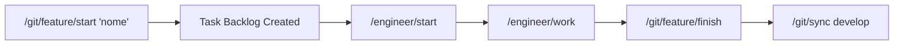
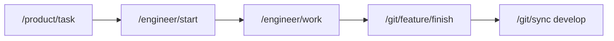
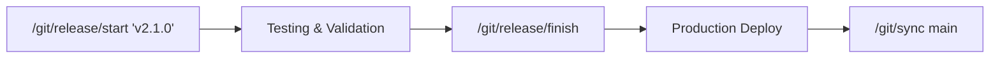
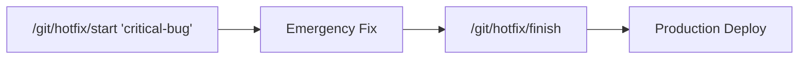
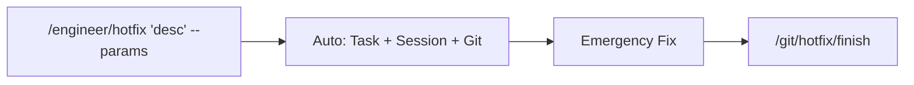

# 🌿 Git Commands - Sistema Onion

**Framework completo de comandos Git com workflows Gitflow integrados ao Sistema Onion.**

Este módulo oferece automação completa para desenvolvimento com Git, desde planejamento até deploy, com integração nativa ClickUp MCP.

## ⚡ **CRÍTICO: Cursor Commands vs Terminal**

### 🎮 **Como Usar os Comandos Git**

Todos os comandos deste módulo são **[Cursor Commands](https://cursor.com/pt-BR/docs/agent/chat/commands)** executados no **chat da Cursor**:

```markdown
# ✅ CORRETO - No chat da Cursor IDE:

/git/init
/git/feature/start "user-authentication"
/git/feature/publish
/git/release/finish

# ❌ INCORRETO - NÃO são comandos bash/shell:

$ /git/init # Não funciona no terminal
$ ./git/feature/start # Não é script executável
```

### 🧠 **Arquitetura dos Comandos**

- **Interface**: Cursor Commands (digitados no chat)
- **Definição**: Arquivos `.md` nesta pasta definem workflows
- **Execução**: Cursor AI interpreta e executa bash scripts internos
- **UX**: Modern CLI via `${CLAUDE_PLUGIN_ROOT}/reference/utils/modern-cli-ux.sh`

---

## 📋 **Comandos Disponíveis**

### **🆘 Setup e Ajuda**

#### **`/git/help`** - Sistema de Ajuda Completo

**Finalidade**: Cartão de referência e troubleshooting para todos workflows Gitflow  
**Uso**: `/git/help`

- ✅ Quick reference de todos os comandos
- ✅ Troubleshooting automático com soluções
- ✅ Examples práticos por workflow
- ✅ Guidance vs execution (comandos vs @gitflow-specialist)

#### **`/git/init`** - Setup Gitflow Automático

**Finalidade**: Inicializar repositório com Gitflow e ClickUp integration  
**Uso**: `/git/init`

- ✅ Master/main detection automática
- ✅ Setup develop branch + configurações
- ✅ ClickUp integration se sessão ativa
- ✅ Validações de segurança completas

---

### **🌿 Feature Development**

#### **`/git/feature/start "nome"`** - Criar Feature Backlog

**Finalidade**: Criar task ClickUp para feature (planejamento, sem desenvolvimento)  
**Uso**: `/git/feature/start "implementar-oauth-authentication"`

- ✅ Task ClickUp com tag "backlog" criada
- ✅ Descrição estruturada + próximos passos
- ✅ Integração com `/engineer/start` para desenvolvimento
- ✅ Auto-detecção de lista ClickUp atual

#### **`/git/feature/finish`** - Finalizar Feature Development

**Finalidade**: Merge feature → develop + cleanup automático  
**Uso**: `/git/feature/finish` (na feature branch)

- ✅ Merge feature → develop com validações
- ✅ Cleanup branches locais/remotos com confirmação
- ✅ Update ClickUp task → "Done" + comentário
- ✅ Archive automático da sessão de trabalho

---

### **🚀 Release Management**

#### **`/git/release/start "version"`** - Iniciar Release

**Finalidade**: Preparar release com versionamento semântico automático  
**Uso**:

```bash
/git/release/start "v2.1.0"    # Versão específica
/git/release/start "patch"     # Auto-bump patch (2.0.1 → 2.0.2)
/git/release/start "minor"     # Auto-bump minor (2.0.1 → 2.1.0)
/git/release/start "major"     # Auto-bump major (2.0.1 → 3.0.0)
```

- ✅ Release branch criada a partir de develop
- ✅ Auto-versioning (package.json, version.txt, VERSION)
- ✅ Changelog preparation automática
- ✅ ClickUp release task com checklist
- ✅ Validações de conflito (branches e tags)

#### **`/git/release/finish`** - Finalizar Release

**Finalidade**: Deploy production com duplo merge + tags  
**Uso**: `/git/release/finish` (na release branch)

- ✅ Duplo merge: release → main + develop
- ✅ Tag anotada com metadata completa
- ✅ Deploy preparation hooks
- ✅ ClickUp completion + release notes
- ✅ Branch cleanup com confirmações

---

### **🔥 Emergency Hotfix**

#### **`/git/hotfix/start "nome"`** - Emergency Hotfix Setup

**Finalidade**: Hotfix emergencial a partir de produção (main/master)  
**Uso**: `/git/hotfix/start "fix-payment-gateway-timeout"`

- ✅ Hotfix branch a partir de main/master
- ✅ Auto-versioning patch emergencial
- ✅ ClickUp emergency task (prioridade 1)
- ✅ Emergency auto-save de mudanças
- ✅ Rollback preparation desde início

#### **`/git/hotfix/finish`** - Deploy Crítico Emergency

**Finalidade**: Deploy emergencial com duplo merge acelerado  
**Uso**: `/git/hotfix/finish` (na hotfix branch)

- ✅ Duplo merge emergencial (main + develop)
- ✅ Production-first strategy com overrides
- ✅ Emergency tag + monitoring requirements
- ✅ SLA < 2 horas + production health verification
- ✅ ClickUp emergency completion

---

### **💥 Workflow Híbrido**

#### **`/engineer/hotfix "desc" [params]`** - Emergency Workflow Completo

**Finalidade**: Task ClickUp + Git hotfix + Session management em 1 comando  
**Uso**:

```bash
/engineer/hotfix "Fix critical payment timeout"
/engineer/hotfix "Security auth patch" --related-tasks="123,456" --tags="security"
```

**Parâmetros**:

- `--related-tasks="id1,id2"` - Link tasks relacionadas
- `--tags="urgent,security"` - Tags adicionais
- `--status="In Progress"` - Status inicial
- `--priority=1` - Prioridade (1=urgent)

- ✅ Executa `/product/task` + `/git/hotfix/start` internamente
- ✅ Session management completo (context, plan, notes)
- ✅ Emergency automation: task + session + git
- ✅ Parameter parsing + ClickUp linking

---

### **🔄 Pós-Merge**

#### **`/git/sync [branch]`** - Sincronização Automática

**Finalidade**: Sincronização pós-merge com cleanup de branches  
**Uso**:

```bash
/git/sync              # Sincroniza com develop (padrão)
/git/sync main         # Sincroniza com main
/git/sync staging      # Sincroniza com staging
```

- ✅ Checkout automático + pull das mudanças
- ✅ Limpeza segura de branch anterior
- ✅ Atualização automática task ClickUp
- ✅ Gestão inteligente de sessões (3000+ linhas)

---

## 🎯 **Workflows Completos**

### **🌟 Feature Development (Método 1 - Planejado):**



### **⚡ Feature Development (Método 2 - Direto):**



### **🚀 Release Workflow:**



### **🔥 Emergency Hotfix (Método 1 - Separado):**



### **💥 Emergency Hotfix (Método 2 - Híbrido):**



---

## 🔗 **Integração Sistema Onion**

### **Comandos por Categoria:**

| Categoria   | Comandos                                    | Finalidade                    |
| ----------- | ------------------------------------------- | ----------------------------- |
| **Setup**   | `/git/help`, `/git/init`                    | Help system + Gitflow setup   |
| **Feature** | `/git/feature/start`, `/git/feature/finish` | Development workflow          |
| **Release** | `/git/release/start`, `/git/release/finish` | Production deployment         |
| **Hotfix**  | `/git/hotfix/start`, `/git/hotfix/finish`   | Emergency fixes               |
| **Híbrido** | `/engineer/hotfix`                          | All-in-one emergency workflow |
| **Sync**    | `/git/sync`                                 | Post-merge synchronization    |

### **Integração com Outros Comandos:**

| Comando Anterior     | Comando Git                               | Resultado Final             |
| -------------------- | ----------------------------------------- | --------------------------- |
| `/product/task`      | `/engineer/start` + `/git/feature/finish` | Feature completa            |
| `/git/feature/start` | `/engineer/start` + `/git/feature/finish` | Backlog → Production        |
| `/engineer/work`     | `/git/feature/finish`                     | Development → Merge         |
| `/engineer/pr`       | `/git/sync`                               | PR merge → Clean state      |
| `/git/release/start` | `/git/release/finish`                     | Version → Production        |
| Emergency issue      | `/engineer/hotfix`                        | Issue → Fixed in production |

---

## 🛠️ **Características Técnicas**

### **🔍 Auto-Detecção:**

- **Master/Main**: Detecta automaticamente convenção do repositório
- **ClickUp Lists**: Auto-detecção via sessão ativa ou API
- **Version Files**: package.json, version.txt, VERSION
- **Current Context**: Task IDs, session state, branch status

### **🔗 ClickUp Integration:**

- **20+ API calls** implementadas com graceful degradation
- **Task creation**: Automática com templates estruturados
- **Status updates**: Automático baseado em workflow phase
- **Comments**: Formatados com progresso e metadata técnica
- **Linking**: Tasks relacionadas e parent-child relationships

### **⚙️ Versionamento Semântico:**

```bash
# Auto-bump types:
patch: 2.0.1 → 2.0.2  # Bug fixes
minor: 2.0.1 → 2.1.0  # New features
major: 2.0.1 → 3.0.0  # Breaking changes

# Specific versions:
/git/release/start "v2.1.0"  # Exact version
/git/release/start "2.1.0"   # Without v prefix
```

### **🚨 Emergency Features:**

- **SLA < 2 horas**: Workflows acelerados para emergências
- **Auto-save**: Mudanças não commitadas salvas automaticamente
- **Production-first**: Merge strategy priorizando produção
- **Override capabilities**: Emergency confirmations para ações críticas
- **Rollback ready**: Preparation automática desde início

### **🛡️ Validações de Segurança:**

- Estado git limpo antes de operações críticas
- Confirmações inteligentes apenas para ações irreversíveis
- Conflict detection antes de merges
- Tag e branch validation
- Remote connectivity checks

---

## 📊 **Métricas de Performance**

### **🎯 Objetivos de Eficiência:**

- **70% redução** no tempo de gestão de branches
- **Erro humano reduzido** através de automação
- **Zero downtime** em deploys quando possível
- **Tracking completo** de decisões técnicas

### **📈 Benefícios Mensuráveis:**

- **Feature workflow**: 5 mins vs 15+ mins manual
- **Release process**: 10 mins vs 30+ mins manual
- **Emergency hotfix**: < 2 horas vs 4+ horas manual
- **ClickUp sync**: Automático vs manual updates

---

## 🎓 **Guias de Uso**

### **🌟 Para Iniciantes:**

1. **Setup inicial**: `/git/init`
2. **Criar feature**: `/git/feature/start "nome"`
3. **Desenvolver**: `/engineer/start nome-feature`
4. **Finalizar**: `/git/feature/finish`
5. **Limpar**: `/git/sync develop`

### **⚡ Para Experts:**

- **Release rápida**: `/git/release/start "minor"` → testing → `/git/release/finish`
- **Emergency hotfix**: `/engineer/hotfix "Critical bug" --related-tasks="123"`
- **Batch operations**: Use parameters para efficiency

### **🆘 Para Emergências:**

1. **Hotfix simples**: `/git/hotfix/start` → fix → `/git/hotfix/finish`
2. **Hotfix completo**: `/engineer/hotfix "desc" --tags="urgent"`
3. **Rollback**: Guidance automático se deploy falhar

---

## 🔧 **Troubleshooting**

### **❌ Problemas Comuns:**

#### **"Branch não encontrada"**

```bash
# Verificar branches disponíveis
git branch -a

# Inicializar Gitflow se necessário
/git/init
```

#### **"Mudanças não commitadas"**

```bash
# Quick commit
git add .
git commit -m "save progress"

# Então executar comando desejado
```

#### **"ClickUp task não atualiza"**

```bash
# Verificar sessão ativa
ls .claude/sessions/

# Criar sessão se necessário
/engineer/start [feature-name]
```

### **🆘 Help Sempre Disponível:**

- **Quick reference**: `/git/help`
- **Detailed guidance**: `@gitflow-specialist "sua pergunta"`
- **Troubleshooting**: Automático em cada comando
- **Examples**: Incluídos em every command

---

## 📚 **Documentação Adicional**

### **🎯 Para Desenvolvimento:**

- **Architecture**: `.claude/sessions/gitflow-commands/architecture.md`
- **Implementation**: Source code em cada comando
- **ClickUp Integration**: `${CLAUDE_PLUGIN_ROOT}/reference/docs/clickup/clickup-formatting.md`

### **🔗 Comandos Relacionados:**

- **Product Management**: `/product/task`, `/product/task-check`
- **Engineering**: `/engineer/start`, `/engineer/work`, `/engineer/pr`
- **Meta Operations**: `/meta/all-tools`
- **Specialized Agents**: `@gitflow-specialist`, `@clickup-specialist`

### **📊 Sistema Completo:**

Este módulo faz parte do **Sistema Onion** com:

- **28+ comandos especializados** organizados por categoria
- **17 agentes de IA especializados**
- **Integração ClickUp MCP** completa
- **Workflows automatizados** do planejamento ao deploy

---

**🌟 Framework completo de Git workflows com automação inteligente e integração ClickUp nativa!**

**Para começar**: `/git/help` ou `/git/init`
| `/engineer/pr` | `/git/sync` | Workflow completo finalizado |
| Manual merge | `/git/sync main` | Sincronização com main |
| Hotfix merge | `/git/sync develop` | Volta para develop |

---

## 🛠️ **Funcionalidades Técnicas**

### **Branch Strategy**

- **Padrão**: `develop` (GitFlow)
- **Auto-criação**: Cria `develop` a partir de `main` se não existir
- **Flexibilidade**: Aceita qualquer branch válida
- **Validação**: Verifica existência remota antes de sincronizar

### **Detecção Inteligente**

- **Contexto Automático**: Detecta task ativa via sessões
- **Branch Atual**: Identifica branch para limpeza
- **Estado Repositório**: Valida git status antes de proceder
- **Múltiplas Sessões**: Usa sessão mais recente automaticamente

### **Operações Git Seguras**

- **Fetch First**: Sempre busca mudanças remotas primeiro
- **Validação**: Verifica estado antes de cada operação
- **Rollback**: Possível reverter operações em caso de erro
- **Logs**: Detalhamento completo para debugging

### **ClickUp Integration**

- **Auto-Status**: Move task para "Done" automaticamente
- **Tag Management**: Remove "in-progress", adiciona "completed"
- **Comentários**: Formatação Unicode consistente
- **Fallback**: Continue git ops mesmo se ClickUp falhar

### **Session Management**

- **Detecção**: Identifica sessões ativas automaticamente
- **Arquivamento**: Opcional, controlado pelo usuário
- **Preservação**: Mantém arquivos importantes (context, plan, notes)
- **Organização**: Estrutura temporal para histórico

---

## ⚠️ **Segurança e Validações**

### **Verificações Automáticas:**

- ✅ **Repositório válido**: Deve ser git repo com remote origin
- ✅ **Mudanças não commitadas**: Avisa e orienta usuário
- ✅ **Branch remota**: Verifica existência antes de checkout
- ✅ **Permissões**: Valida direitos para operações git

### **Proteções Implementadas:**

- 🛡️ **Nunca force push**: Operações sempre seguras
- 🛡️ **Backup implícito**: Git mantém reflog para recovery
- 🛡️ **Confirmações**: Pede confirmação para operações críticas
- 🛡️ **Graceful failure**: Falha de forma controlada

### **Edge Cases Tratados:**

- **Conflitos de merge**: Orientação para resolução manual
- **Network issues**: Retry logic e fallback gracioso
- **Branch inexistente**: Auto-criação ou erro informativo
- **Múltiplas sessões**: Usa mais recente, avisa usuário

---

## 📊 **Formatos de Saída**

### **Saída de Sucesso:**

```
🔄 SINCRONIZAÇÃO COMPLETA

━━━━━━━━━━━━━━━━━━━━━━━━

✅ GIT OPERATIONS:
   ▶ Switched to: develop
   ▶ Pulled latest: 3 new commits
   ▶ Cleaned branch: feature/my-feature

🔗 CLICKUP UPDATED:
   ▶ Task 86abc123: Moved to "Done"
   ▶ Tags updated: +completed, -in-progress
   ▶ Comment added: Sync completed

📁 SESSION STATUS:
   ▶ Session archived: .claude/sessions/archived/[YYYY-MM-DD_HHMM_session-name]/

━━━━━━━━━━━━━━━━━━━━━━━━

⏰ Completed: $(date +'%d/%m/%Y %H:%M') | 🎯 Ready for next task
```

### **Tratamento de Erros:**

```
⚠️ SYNC ISSUE DETECTED

Issue: Uncommitted changes in working directory
Files: src/app.ts, package.json

Solution: Commit or stash changes before sync
Commands:
  git add .
  git commit -m "WIP: save before sync"
  /git/sync

Alternative: Use git stash to temporarily save changes
```

### **Orientações Contextuais:**

```
💡 SYNC TIPS

Current situation: First time using /git/sync
Recommendation: develop branch will be created from main

This follows GitFlow best practices:
- main: Production-ready code
- develop: Integration branch for features
- feature/*: Individual feature branches

Next time: /git/sync will use existing develop branch
```

---

## 🎨 **Padrões e Convenções**

### **Nomenclatura de Branches:**

```
feature/<feature-slug>   # Features normais
hotfix/critical-fix      # Correções urgentes
release/v1.2.0          # Preparação de releases
bugfix/issue-123        # Correções de bugs
```

### **Estratégia de Tags ClickUp:**

```
Adicionadas:     completed, synced
Removidas:       in-progress, under-review, needs-fix
Preservadas:     feature, bug, improvement, research
```

### **Formato de Comentários:**

- **Header**: `✅ TASK CONCLUÍDA - SYNC COMPLETED`
- **Separador**: `━━━━━━━━━━━━━━━━━━━━━━━━`
- **Seções**: Git Operations, Development Status, Final Status
- **Footer**: `⏰ Timestamp | 🤖 Sistema Onion Sync`

### **Estrutura de Arquivamento:**

```
.claude/sessions/archived/
├── [YYYY-MM-DD_HHMM_session-name]/
│   ├── context.md           # Contexto preservado
│   ├── plan.md             # Plano de implementação
│   ├── notes.md            # Notas de desenvolvimento
│   └── task-86ac06261.md   # Link para task ClickUp
```

---

## 🚀 **Roadmap Futuro**

### **Versão Atual (1.0)**

- ✅ Sync básico com develop/main
- ✅ ClickUp integration completa
- ✅ Session management
- ✅ Error handling robusto

### **Versões Futuras**

- **1.1**: Integração com CI/CD pipelines
- **1.2**: Sync com múltiplas branches simultaneamente
- **1.3**: Configuração personalizada via `.onion-config`
- **1.4**: Hooks git para automação adicional
- **2.0**: Integração com outros sistemas de task (Jira, Linear, etc.)

### **Melhorias Planejadas**

- 📈 **Performance**: Cache de operações git para speed up
- 🔧 **Configurabilidade**: Arquivo de config para branches padrão
- 🌐 **Multi-repo**: Sync em monorepos com múltiplos projetos
- 📱 **Notifications**: Integração com Slack/Teams para notificações

---

## 🆘 **Troubleshooting**

### **Problemas Comuns:**

#### **"Branch develop não existe"**

```bash
# Solução automática (comando faz isso)
git checkout main
git checkout -b develop
git push origin develop
/git/sync
```

#### **"Mudanças não commitadas"**

```bash
# Commit temporário
git add .
git commit -m "WIP: save before sync"
/git/sync

# Ou usar stash
git stash push -m "WIP before sync"
/git/sync
git stash pop  # Para recuperar depois
```

#### **"ClickUp não atualizou"**

- Verifique credenciais ClickUp MCP
- Operações git continuam normalmente
- ClickUp pode ser atualizado manualmente depois

#### **"Sessão não foi detectada"**

- Comando funciona sem sessão
- ClickUp integration fica limitada
- Crie sessão com `/product/task` para próximas tasks

### **Logs de Debug:**

```bash
# Ver logs detalhados
git reflog --oneline -10    # Últimas 10 operações git
git log --oneline -5        # Últimos 5 commits
git status                  # Estado atual do repo
```

---

**Sistema Onion Git Commands v1.0**  
**Documentação atualizada**: 22/09/2025 19:18  
**Próxima revisão**: Após implementação completa
