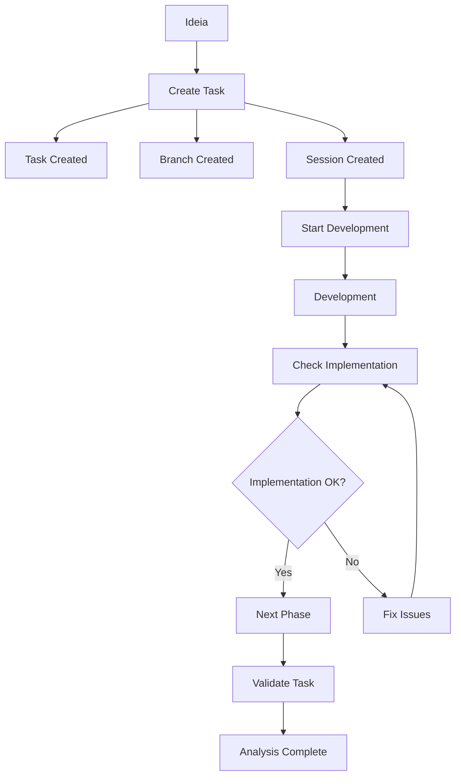

# 📋 Comandos Product - Workflow Completo

Este documento descreve o workflow completo dos comandos de produto no Sistema Onion.

## 🔄 **Fluxo de Trabalho Ideal**



## 🛠️ **Comandos Disponíveis**

### 1. **`/product/task <description>`** 🚀

**Objetivo**: Criar task no ClickUp + Setup completo para desenvolvimento

**O que faz**:

- ✅ Cria task estruturada no ClickUp
- ✅ Cria feature branch `feature/<slug>`
- ✅ Inicializa sessão em `.claude/sessions/<slug>/`
- ✅ Cria arquivos: `context.md`, `plan.md`, `notes.md`

**Quando usar**: Início de qualquer nova funcionalidade

### 2. **`/product/task-check <task-id>`** 🔍

**Objetivo**: Verificar se task foi realmente implementada

**O que faz**:

- ✅ Carrega task do ClickUp
- ✅ Audita projeto atual buscando implementação
- ✅ Compara requisitos vs código real
- ✅ Determina se pode avançar para próxima fase

**Quando usar**: Após desenvolvimento, antes de fechar task

### 3. **`/product/validate-task <task-id>`** 📊

**Objetivo**: Análise estratégica e alinhamento com projeto

**O que faz**:

- ✅ Valida alinhamento com arquitetura
- ✅ Analisa viabilidade técnica
- ✅ Sugere melhorias nos requisitos
- ✅ Fornece recomendações estratégicas

**Quando usar**: Análise de requisitos, tasks problemáticas

### 4. **`/product/presentation <description>`** 🎨

**Objetivo**: Criar apresentações profissionais via Gamma.app

**O que faz**:

- ✅ Analisa tipo de apresentação (tema, task, doc, métricas)
- ✅ Coleta dados relevantes automaticamente
- ✅ Orquestra pipeline completo de geração
- ✅ Entrega apresentação pronta com links

**Quando usar**: Criar pitch decks, case studies, relatórios, apresentações técnicas

### 5. **Outros comandos complementares**:

- **`/product/check`**: Verificação contra meta-specs
- **`/product/spec`**: Criação de especificações
- **`/product/collect`**: Coleta de informações
- **`/product/refine`**: Refinamento de requisitos

## 🔄 **Sistema de Auto-Update ClickUp**

Todos os comandos seguem uma **estratégia consistente de atualização automática** do ClickUp:

### **✅ Updates Automáticos (Sem Confirmação)**

- **Comments informativos** com progresso e resultados
- **Tags de status** (verified, in-development, ready-for-pr)
- **Tracking de atividade** com timestamps
- **Progress updates** baseados em fases

### **⚠️ Confirmação Necessária (Alto Impacto)**

- **Mudanças de status** críticas (To Do → Done)
- **Alterações de prioridade** baseadas em análise
- **Quebra em subtasks** quando escopo é complexo
- **Reatribuição** quando detecta skill mismatch

### **📋 Identificação Inteligente de Tasks**

1. **Sessão ativa**: Usa task-id do `context.md` da sessão atual
2. **Argumento fornecido**: Usa task-id passado pelo usuário
3. **Não identificada**: Pergunta qual task atualizar

## 🎯 **Cenários de Uso**

### **Cenário 1: Nova Feature Completa**

```bash
# 1. Criar task + setup completo
/product/task "Sistema de notificações push"
# ↳ AUTO: Cria task + comment setup + tags

# 2. Iniciar desenvolvimento
/engineer/start notificacoes-push
# ↳ AUTO: Status → "In Progress" + comment início

# 3. Desenvolver com tracking automático
/engineer/work notificacoes-push
# ↳ AUTO: Comments de progresso a cada fase

# 4. Preparar para PR
/engineer/pre-pr
# ↳ AUTO: Comment checklist + tag "ready-for-pr"

# 5. Criar PR
/engineer/pr
# ↳ AUTO: Status ajustado + tag "under-review"

# 6. Verificar implementação final
/product/task-check 86abzwx0w
# ↳ AUTO: Comment verificação + PERGUNTA: mover para Done?

# 7. Análise estratégica final
/product/validate-task 86abzwx0w
# ↳ AUTO: Comment validação + tag "validated"
```

### **Cenário 2: Task Problemática**

```bash
# 1. Analisar task existente
/product/validate-task 86abzwx0w
# ↳ AUTO: Comment análise + PERGUNTA: mudar prioridade?

# 2. Verificar o que foi implementado
/product/task-check 86abzwx0w
# ↳ AUTO: Comment verificação + tag "needs-work"

# 3. Refinar requisitos se necessário
/product/refine <task-description>
```

### **Cenário 3: Auditoria de Qualidade**

```bash
# 1. Verificar múltiplas tasks com tracking automático
/product/task-check 86abzwx0w
/product/task-check 86abzwx1x
/product/task-check 86abzwx2y
# ↳ AUTO: Cada comando adiciona comment de verificação

# 2. Validar alinhamento estratégico
/product/validate-task 86abzwx0w
# ↳ AUTO: Comment validação + decisões estratégicas
```

### **Cenário 4: Criar Apresentação**

```bash
# 1. Apresentação a partir de tema
/product/presentation Crie apresentação sobre nova feature de IA para investidores
# ↳ AUTO: Coleta dados + gera narrativa + diagramas + apresentação Gamma

# 2. Apresentação a partir de task
/product/presentation Transforme task #86abzwx0w em case study para stakeholders
# ↳ AUTO: Busca task ClickUp + gera apresentação + comenta na task

# 3. Apresentação técnica
/product/presentation Converta docs/architecture.md em apresentação para time técnico
# ↳ AUTO: Lê doc + adapta conteúdo + gera diagramas + apresentação

# 4. Relatório de métricas
/product/presentation Crie relatório com métricas do Q4 2024
# ↳ AUTO: Busca dados + cria gráficos + apresentação data-driven
```

## 📁 **Estrutura da Sessão**

Quando você usa `/product/task`, é criada esta estrutura:

```
.claude/sessions/<feature-slug>/
├── context.md          # Contexto e objetivos
├── architecture.md     # Arquitetura técnica (criado por /engineer/start)
├── plan.md            # Plano de implementação por fases
└── notes.md           # Notas e decisões
```

### **Integração com Comandos**:

- **`/engineer/start <slug>`**: Usa e expande a sessão
- **`/product/task-check`**: Lê context.md para entender escopo
- **`/product/validate-task`**: Considera arquitetura da sessão

## 🚀 **Próximos Passos Recomendados**

Depois de criar uma task com `/product/task`:

1. **Revisar** os arquivos criados em `.claude/sessions/<slug>/`
2. **Executar** `/engineer/start <slug>` para iniciar desenvolvimento
3. **Usar** `/product/task-check` periodicamente durante desenvolvimento
4. **Finalizar** com `/product/validate-task` para análise completa

## 📊 **Auto-Updates por Comando**

### **✅ Updates Automáticos**

- **`/product/task`**: Comment setup + tags automáticas
- **`/product/presentation`**: Comment com links da apresentação (se baseada em task)
- **`/engineer/start`**: Status → "In Progress" + comment início
- **`/engineer/work`**: Comments de progresso por fase
- **`/engineer/pre-pr`**: Comment checklist + tags qualidade
- **`/engineer/pr`**: Status ajuste + comment PR + tag "under-review"

### **⚠️ Com Confirmação**

- **`/product/task-check`**: Comment verificação + pergunta para status "Done"
- **`/product/validate-task`**: Comment validação + confirmação para mudanças de prioridade

## 💡 **Benefícios da Estratégia**

1. **Rastreabilidade Total**: Cada ação gera histórico automático no ClickUp
2. **Produtividade Máxima**: Elimina atualizações manuais repetitivas
3. **Controle Inteligente**: Confirma apenas mudanças críticas
4. **Sincronização**: Sessões locais sempre sincronizadas com ClickUp
5. **Visibilidade**: Stakeholders veem progresso em tempo real

---

**Sistema completamente integrado! Auto-updates inteligentes em todos os comandos! 🚀🧅**
