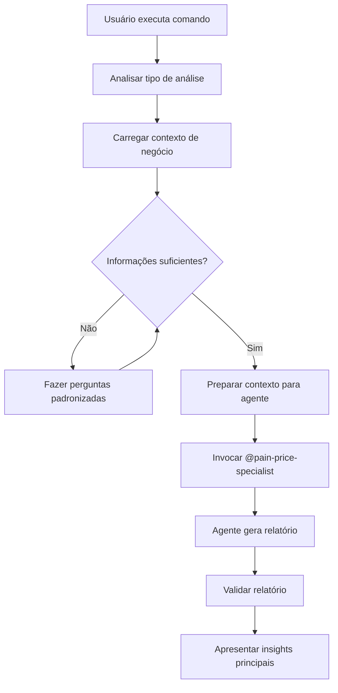

# Análise de Dor e Precificação do Cliente

Comando facilitador para executar análises profundas de dores do cliente e precificação estratégica usando o agente especializado `@pain-price-specialist`.

## 📢 Regras de Comunicação (Cursor v2+)

### Comunicação com o Usuário
1. Use markdown com backticks para formatar nomes de arquivos, diretórios, funções e classes
2. Evite emojis a menos que sejam extremamente informativos ou explicitamente solicitados
3. NUNCA mencione nomes de ferramentas - use linguagem natural
4. NUNCA use `echo` ou ferramentas de terminal para comunicar pensamentos ao usuário
5. Toda comunicação deve estar diretamente na resposta de texto

### Execução de Ferramentas
1. Não se refira a nomes de ferramentas ao falar com o usuário
2. Implemente mudanças ao invés de apenas sugerir (padrão)
3. Maximize chamadas paralelas quando não há dependências
4. Use ferramentas especializadas ao invés de comandos de terminal

## Requisitos do Usuário
<requirements>
#Comando para executar e tirar o melhor proveito do agente @pain-price-specialist
</requirements>

---

## 🎯 Propósito

Este comando é um **wrapper otimizado** para o agente `@pain-price-specialist`, facilitando análises profundas de dores do cliente e precificação estratégica através de uma interface simplificada.

**Diferencial:** Ao invés de invocar `@pain-price-specialist` diretamente, este comando:
- 🎯 Analisa automaticamente o contexto da solicitação
- 🔍 Identifica tipo de análise necessária (cliente específico, segmento, validação)
- 📊 Carrega contexto de negócio automaticamente
- 🚀 Prepara informações para o agente de forma otimizada
- ✅ Garante geração de relatório estruturado

---

## 📋 Processo

### 1. Análise da Solicitação

Identifique automaticamente o **tipo de análise** solicitada:

#### **Tipo A: Análise de Cliente Específico**
```yaml
Indicadores:
  - Usuário menciona cliente/empresa específica
  - Menciona contexto específico do cliente
  - Exemplo: "Analise a dor do cliente StartupXYZ que precisa de certificação ISO 27001"

Ação:
  - Identificar nome/contexto do cliente
  - Preparar perguntas de elucidação específicas
  - Carregar contexto de negócio relevante
  - Invocar @pain-price-specialist com contexto completo
```

#### **Tipo B: Análise de Segmento**
```yaml
Indicadores:
  - Usuário menciona segmento ou persona
  - Não menciona cliente específico
  - Exemplo: "Analise dores das startups que buscam certificação"

Ação:
  - Identificar segmento/persona
  - Carregar informações do segmento (CUSTOMER_PERSONAS.md)
  - Carregar jornada do cliente (CUSTOMER_JOURNEY.md)
  - Preparar análise comparativa
  - Invocar @pain-price-specialist
```

#### **Tipo C: Validação de Proposta de Valor**
```yaml
Indicadores:
  - Usuário menciona validação ou alinhamento
  - Menciona preço ou proposta de valor atual
  - Exemplo: "Valide se R$ 1.000 está alinhado com a dor dos clientes"

Ação:
  - Extrair proposta de valor/preço atual
  - Carregar contexto de produto (PRODUCT_STRATEGY.md)
  - Carregar processo de vendas (SALES_PROCESS.md)
  - Preparar análise de alinhamento
  - Invocar @pain-price-specialist
```

#### **Tipo D: Análise Comparativa**
```yaml
Indicadores:
  - Usuário menciona comparação ou múltiplos cenários
  - Menciona alternativas ou modelos diferentes
  - Exemplo: "Compare precificação fixa vs outcome-based para enterprise"

Ação:
  - Identificar cenários a comparar
  - Carregar contexto competitivo (COMPETITIVE_LANDSCAPE.md)
  - Preparar análise comparativa estruturada
  - Invocar @pain-price-specialist para cada cenário
```

### 2. Preparação de Contexto

**2.1. Carregar Conhecimento Base**
- Ler `docs/knowbase/concepts/identificar-precificar-dor-cliente.md` para referência
- Identificar métodos mais apropriados para o caso
- Preparar resumo de frameworks disponíveis

**2.2. Carregar Contexto de Negócio**
Carregar documentos relevantes em paralelo:
- `docs/business-context/CUSTOMER_PERSONAS.md` - Para entender segmentos
- `docs/business-context/CUSTOMER_JOURNEY.md` - Para entender jornada
- `docs/business-context/VOICE_OF_CUSTOMER.md` - Para entender feedback
- `docs/business-context/PRODUCT_STRATEGY.md` - Para entender estratégia
- `docs/business-context/SALES_PROCESS.md` - Para entender vendas
- `docs/business-context/COMPETITIVE_LANDSCAPE.md` - Para benchmarking

**2.3. Preparar Perguntas de Elucidação**
Se informações não fornecidas, preparar perguntas padronizadas:

**Sobre o Cliente:**
- Qual o segmento? (Startup, PME, Enterprise)
- Qual a persona principal?
- Qual o contexto atual?

**Sobre a Dor:**
- Qual o problema principal?
- Como resolve atualmente?
- Qual o impacto financeiro/temporal?
- Qual a urgência?

**Sobre Precificação:**
- Qual o valor percebido?
- Quanto está disposto a pagar?
- Existem alternativas? Quais preços?

### 3. Invocação Otimizada do Agente

**3.1. Preparar Contexto para o Agente**
- Consolidar informações coletadas
- Estruturar contexto de forma clara
- Identificar métodos de análise apropriados
- Preparar instruções específicas

**3.2. Invocar @pain-price-specialist**
```
@pain-price-specialist [contexto preparado] + [solicitação específica do usuário]
```

**3.3. Garantir Geração de Relatório**
- Verificar que agente criará relatório em `docs/reports/pain-price/*-report.md`
- Confirmar estrutura do relatório esperada
- Validar que todas as seções serão preenchidas

### 4. Validação e Apresentação

**4.1. Validar Relatório Gerado**
- Verificar existência do arquivo `docs/reports/pain-price/*-report.md`
- Validar completude das seções
- Confirmar cálculos e métricas

**4.2. Apresentar Resultados**
- Resumo executivo dos principais insights
- Dores identificadas e priorizadas
- Recomendação de precificação
- Próximos passos sugeridos

---

## 🎯 Casos de Uso

### Caso 1: Análise de Cliente Específico

**Comando:**
```bash
/product/analyze-pain-price Analise a dor do cliente StartupXYZ que precisa de capacitação em segurança para obter certificação ISO 27001
```

**O que acontece:**
1. Identifica tipo: Cliente específico
2. Carrega contexto de negócio (personas, jornada)
3. Prepara perguntas de elucidação se necessário
4. Invoca @pain-price-specialist com contexto completo
5. Valida relatório gerado
6. Apresenta insights principais

**Output esperado:**
- Relatório completo em `docs/reports/pain-price/*-report.md`
- Análise de dores priorizadas
- Recomendação de precificação
- Estratégias de Customer Success

---

### Caso 2: Análise de Segmento

**Comando:**
```bash
/product/analyze-pain-price Analise o segmento de startups que buscam certificação ISO 27001 e recomende estratégia de precificação
```

**O que acontece:**
1. Identifica tipo: Análise de segmento
2. Carrega informações do segmento (CUSTOMER_PERSONAS.md)
3. Carrega jornada do cliente
4. Prepara análise comparativa
5. Invoca @pain-price-specialist
6. Gera relatório com recomendações estratégicas

**Output esperado:**
- Análise de padrões de dores do segmento
- Comparação de modelos de precificação
- Recomendações estratégicas por segmento

---

### Caso 3: Validação de Proposta de Valor

**Comando:**
```bash
/product/analyze-pain-price Valide se nossa proposta de valor de R$ 1.000 por pacote está alinhada com a dor dos clientes
```

**O que acontece:**
1. Identifica tipo: Validação
2. Extrai proposta de valor atual (R$ 1.000)
3. Carrega contexto de produto e vendas
4. Prepara análise de alinhamento
5. Invoca @pain-price-specialist
6. Gera relatório de validação

**Output esperado:**
- Análise de alinhamento valor/preço
- Comparação com disposição a pagar
- Recomendações de ajuste se necessário
- Estratégias de comunicação de valor

---

### Caso 4: Análise Comparativa

**Comando:**
```bash
/product/analyze-pain-price Compare precificação fixa (R$ 1.000) vs outcome-based para clientes enterprise
```

**O que acontece:**
1. Identifica tipo: Comparativo
2. Identifica cenários (fixo vs outcome-based)
3. Carrega contexto competitivo
4. Prepara análise comparativa
5. Invoca @pain-price-specialist para cada cenário
6. Gera relatório comparativo

**Output esperado:**
- Comparação detalhada de modelos
- Análise de trade-offs
- Recomendações por cenário
- Estratégia de implementação

---

## 💡 Guidelines

### ✅ Boas Práticas

**Preparação:**
- ✅ Carregue contexto de negócio em paralelo quando possível
- ✅ Identifique tipo de análise antes de invocar agente
- ✅ Prepare perguntas de elucidação se informações faltantes
- ✅ Estruture contexto de forma clara para o agente

**Invocação:**
- ✅ Forneça contexto completo ao agente
- ✅ Seja específico sobre tipo de análise desejada
- ✅ Mencione métodos preferidos se houver
- ✅ Especifique formato de output esperado

**Validação:**
- ✅ Verifique que relatório foi gerado
- ✅ Valide completude das seções
- ✅ Confirme cálculos e métricas
- ✅ Apresente insights principais ao usuário

### ⚠️ Atenções Especiais

**Contexto Insuficiente:**
- ⚠️ Se informações faltantes, faça perguntas padronizadas
- ⚠️ Não invoque agente sem contexto mínimo necessário
- ⚠️ Valide informações antes de prosseguir

**Múltiplas Análises:**
- ⚠️ Para análises comparativas, invoque agente múltiplas vezes
- ⚠️ Consolide resultados em relatório único
- ⚠️ Documente diferenças e trade-offs claramente

**Relatório Não Gerado:**
- ⚠️ Se agente não gerar relatório, solicite explicitamente
- ⚠️ Verifique permissões de escrita em `docs/reports/`
- ⚠️ Valide estrutura do relatório esperada

### ❌ O Que Evitar

**Preparação:**
- ❌ Não invoque agente sem contexto mínimo
- ❌ Não assuma informações sobre cliente sem validação
- ❌ Não ignore contexto de negócio disponível

**Invocação:**
- ❌ Não forneça contexto genérico demais
- ❌ Não omita informações relevantes
- ❌ Não especifique métodos sem justificativa

**Validação:**
- ❌ Não assuma que relatório foi gerado sem verificar
- ❌ Não ignore erros ou avisos do agente
- ❌ Não apresente resultados sem validar

---

## 📊 Exemplos Detalhados

### Exemplo 1: Análise Completa de Cliente

**Input:**
```bash
/product/analyze-pain-price Analise a dor do cliente TechStartup que precisa capacitar equipe em segurança da informação para obter certificação ISO 27001. A empresa tem 25 funcionários e está se preparando para rodada de investimento.
```

**Processo Executado:**
1. **Análise:** Tipo A - Cliente específico identificado
2. **Contexto Carregado:**
   - CUSTOMER_PERSONAS.md → Persona: CEO Startup
   - CUSTOMER_JOURNEY.md → Etapa: Preparação para investimento
   - VOICE_OF_CUSTOMER.md → Padrões de feedback
   - SALES_PROCESS.md → Processo de vendas
3. **Perguntas Preparadas:**
   - Qual o impacto de não ter certificação?
   - Quanto tempo até investimento?
   - Qual orçamento disponível?
4. **Agente Invocado:**
   ```
   @pain-price-specialist Analise a dor do cliente TechStartup [contexto completo fornecido]
   ```
5. **Validação:**
   - Relatório gerado em `docs/reports/pain-price/*-report.md`
   - Seções completas validadas
   - Cálculos verificados

**Output Apresentado:**
```markdown
## 📊 Análise Concluída - TechStartup

### Dores Identificadas (Priorizadas):
1. **Falta de certificação ISO 27001** (Score: 75)
   - Impacto: Bloqueio para investimento
   - Urgência: Alta (investimento em 3 meses)

2. **Equipe sem capacitação adequada** (Score: 60)
   - Impacto: Riscos de segurança
   - Urgência: Média

### Recomendação de Precificação:
- **Modelo Atual:** R$ 1.000 (fixo) - Adequado para MVP
- **Modelo Recomendado (Enterprise):** R$ 5.000 base + R$ 2.000 se certificação obtida
- **Justificativa:** Alinhamento com outcome desejado

### Próximos Passos:
1. Apresentar proposta outcome-based para TechStartup
2. Validar disposição a pagar
3. Estruturar contrato com métricas de sucesso

📄 Relatório completo: `docs/reports/pain-price/*-report.md`
```

---

### Exemplo 2: Validação de Proposta de Valor

**Input:**
```bash
/product/analyze-pain-price Valide se R$ 1.000 por pacote está alinhado com a dor dos clientes startups
```

**Processo Executado:**
1. **Análise:** Tipo C - Validação identificada
2. **Contexto Carregado:**
   - PRODUCT_STRATEGY.md → Estratégia atual
   - SALES_PROCESS.md → Processo de vendas
   - CUSTOMER_PERSONAS.md → Personas de startups
   - COMPETITIVE_LANDSCAPE.md → Preços da concorrência
3. **Análise Preparada:**
   - Comparar R$ 1.000 com valor percebido
   - Comparar com alternativas (consultoria direta)
   - Validar disposição a pagar do segmento
4. **Agente Invocado:**
   ```
   @pain-price-specialist Valide proposta de valor R$ 1.000 [contexto completo]
   ```
5. **Validação:**
   - Relatório de validação gerado
   - Análise de alinhamento concluída

**Output Apresentado:**
```markdown
## ✅ Validação de Proposta de Valor

### Análise de Alinhamento:
- **Preço Atual:** R$ 1.000/pacote
- **Valor Percebido:** R$ 5.000-15.000 (vs consultoria direta)
- **Disposição a Pagar:** R$ 800-1.500 (validado com segmento)
- **Alinhamento:** ✅ BOM (preço dentro do range de WTP)

### Comparação Competitiva:
- Consultoria direta: R$ 5.000-15.000
- Cursos online: R$ 200-500
- **Nossa proposta:** R$ 1.000 (posicionamento intermediário) ✅

### Recomendações:
- ✅ Preço atual está bem posicionado
- 💡 Considerar modelo outcome-based para enterprise
- 📊 Monitorar conversão e ajustar se necessário

📄 Relatório completo: `docs/reports/pain-price/*-report.md`
```

---

## 🔧 Integração com Outros Comandos

### Comandos que Podem Usar Este Comando:
- `/product/task` - Pode sugerir análise antes de criar task
- `/product/spec` - Pode usar análise para validar especificação
- `/product/validate-task` - Pode usar análise para validar requisitos

### Comandos que Este Comando Pode Usar:
- `/product/task` - Criar tasks relacionadas a análises
- `/product/spec` - Especificações técnicas baseadas em análises

### Agentes Relacionados:
- `@pain-price-specialist` - Agente especializado (invocado por este comando)
- `@product-agent` - Coordenação estratégica de produto
- `@onion` - Orquestração de workflows complexos

---

## 📊 Formato de Relatório Esperado

O agente `@pain-price-specialist` gera relatório em `docs/reports/pain-price/*-report.md` com:

```markdown
# Relatório de Análise de Dor e Precificação - [Nome]

## 📋 Resumo Executivo
- Cliente/Segmento analisado
- Dores principais identificadas
- Recomendação de precificação
- Próximos passos

## 🔍 Análise de Dores
- Dores identificadas e priorizadas
- Métodos utilizados
- Análise detalhada

## 💰 Análise de Precificação
- Valor percebido
- Método recomendado
- Estrutura de preço proposta
- Comparação competitiva

## 🎯 Recomendações Estratégicas
- Para produto
- Para vendas
- Para Customer Success

## 📊 Métricas e KPIs
- Métricas de sucesso
- Métricas de precificação

## 🔄 Próximos Passos
- Ações recomendadas
```

---

## 🔍 Troubleshooting

### Problema: Tipo de análise não identificado
**Causa:** Solicitação ambígua ou incompleta

**Solução:**
```markdown
Pergunte ao usuário:
- Qual cliente/segmento deseja analisar?
- Qual o objetivo da análise?
- Há alguma proposta de valor/preço específica?
- É análise comparativa?
```

---

### Problema: Contexto de negócio não encontrado
**Causa:** Arquivos de contexto não existem ou caminho incorreto

**Solução:**
```markdown
1. Verificar existência de docs/business-context/
2. Listar arquivos disponíveis
3. Carregar arquivos existentes
4. Informar usuário sobre arquivos faltantes
5. Prosseguir com contexto disponível
```

---

### Problema: Relatório não gerado pelo agente
**Causa:** Agente não criou arquivo ou erro na criação

**Solução:**
```markdown
1. Verificar se agente foi invocado corretamente
2. Verificar permissões de escrita em docs/reports/
3. Criar diretório se não existir
4. Solicitar explicitamente criação do relatório ao agente
5. Validar estrutura do relatório esperada
```

---

### Problema: Informações insuficientes sobre cliente
**Causa:** Usuário não forneceu contexto suficiente

**Solução:**
```markdown
1. Fazer perguntas padronizadas de elucidação
2. Carregar informações do segmento/persona se aplicável
3. Usar contexto de negócio para inferir informações comuns
4. Documentar suposições no relatório
5. Validar informações com usuário antes de finalizar
```

---

## 📚 Referências

**Knowbase:**
- `docs/knowbase/concepts/identificar-precificar-dor-cliente.md`

**Contexto de Negócio:**
- `docs/business-context/CUSTOMER_PERSONAS.md`
- `docs/business-context/CUSTOMER_JOURNEY.md`
- `docs/business-context/VOICE_OF_CUSTOMER.md`
- `docs/business-context/PRODUCT_STRATEGY.md`
- `docs/business-context/SALES_PROCESS.md`
- `docs/business-context/COMPETITIVE_LANDSCAPE.md`

**Agente:**
- `@pain-price-specialist` - Especialista em análise de dores e precificação

---

## 🎯 Checklist de Validação

Após execução, verificar:

### Preparação
- [ ] Tipo de análise identificado corretamente
- [ ] Contexto de negócio carregado
- [ ] Perguntas de elucidação preparadas (se necessário)
- [ ] Informações estruturadas para o agente

### Execução
- [ ] Agente invocado com contexto completo
- [ ] Instruções claras fornecidas ao agente
- [ ] Métodos de análise apropriados identificados

### Validação
- [ ] Relatório gerado em `docs/reports/pain-price/*-report.md`
- [ ] Todas as seções preenchidas
- [ ] Cálculos e métricas validados
- [ ] Insights principais apresentados ao usuário

### Qualidade
- [ ] Análise contextualizada com negócio
- [ ] Recomendações acionáveis fornecidas
- [ ] Próximos passos claros definidos
- [ ] Relatório pronto para uso

---

## 💡 Dicas de Uso

### Dica 1: Seja Específico
**Ruim:** "Analise dores dos clientes"  
**Bom:** "Analise a dor do cliente StartupXYZ que precisa de certificação ISO 27001"

### Dica 2: Mencione Contexto Relevante
**Ruim:** "Analise precificação"  
**Bom:** "Valide se R$ 1.000 está alinhado com dores de startups que buscam certificação"

### Dica 3: Especifique Objetivo
**Ruim:** "Analise cliente"  
**Bom:** "Analise dores do cliente TechStartup para recomendar estratégia de precificação enterprise"

### Dica 4: Use para Validação
**Bom:** "Valide se nossa proposta de valor está correta"  
**Bom:** "Compare modelos de precificação para enterprise"

---

## 🔄 Fluxo Completo



---

## 📖 FAQ

**P: Posso usar sem especificar cliente?**  
R: Sim, pode analisar segmentos ou validar proposta de valor geral.

**P: O comando faz perguntas automaticamente?**  
R: Sim, se informações faltantes, faz perguntas padronizadas de elucidação.

**P: Posso especificar métodos de análise?**  
R: Sim, mencione métodos preferidos na solicitação (ex: "usando JTBD e Value Proposition Canvas").

**P: O relatório é sempre gerado?**  
R: Sim, o agente sempre gera relatório em `docs/reports/pain-price/*-report.md`.

**P: Posso usar para análises comparativas?**  
R: Sim, mencione múltiplos cenários na solicitação.

**P: Como revisar análises anteriores?**  
R: Relatórios são salvos em `docs/reports/pain-price/*-report.md` (sobrescreve último, considere versionar se necessário).

---

## 🎉 Resumo de Uso

**Sintaxe básica:**
```bash
/product/analyze-pain-price [descrição da análise desejada]
```

**O que acontece:**
1. ✅ Analisa tipo de análise necessária
2. ✅ Carrega contexto de negócio automaticamente
3. ✅ Prepara informações para o agente
4. ✅ Invoca @pain-price-specialist otimizado
5. ✅ Valida relatório gerado
6. ✅ Apresenta insights principais

**Output:**
- Relatório completo em `docs/reports/pain-price/*-report.md`
- Análise de dores priorizadas
- Recomendação de precificação estratégica
- Próximos passos acionáveis

---

**Exemplos rápidos:**
```bash
# Análise de cliente específico
/product/analyze-pain-price Analise a dor do cliente TechStartup que precisa de certificação ISO 27001

# Análise de segmento
/product/analyze-pain-price Analise dores das startups que buscam capacitação em compliance

# Validação de proposta
/product/analyze-pain-price Valide se R$ 1.000 está alinhado com a dor dos clientes

# Análise comparativa
/product/analyze-pain-price Compare precificação fixa vs outcome-based para enterprise
```

---

**O comando está pronto para facilitar análises profundas de dores e precificação!** 🚀

