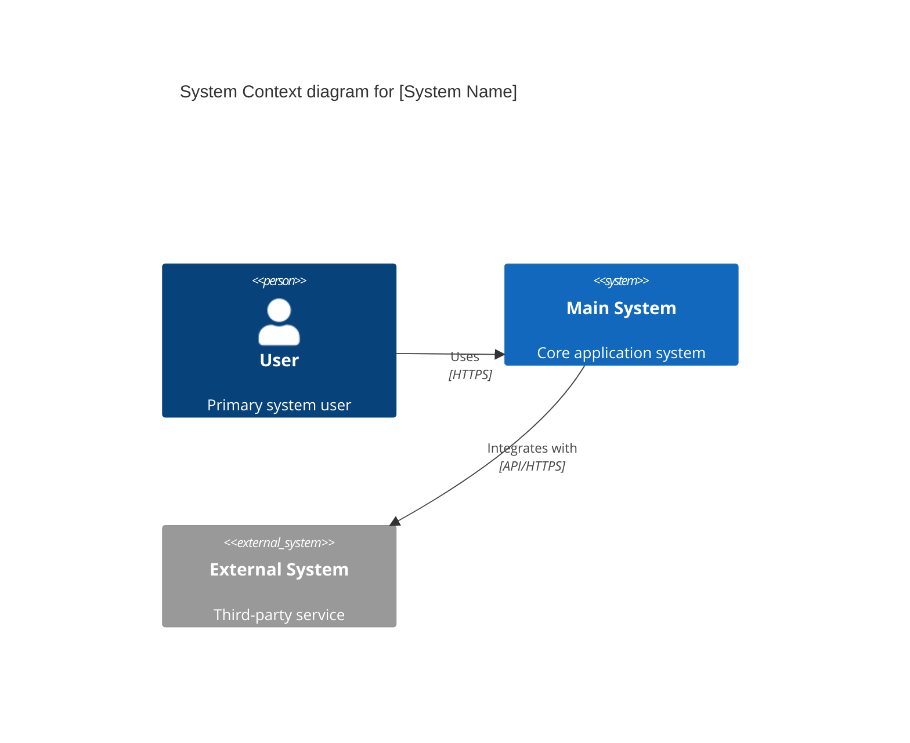
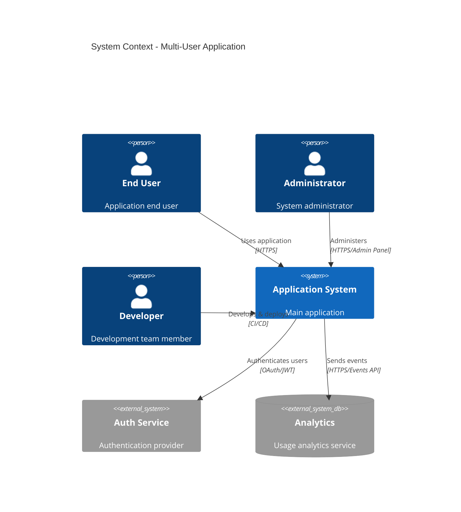
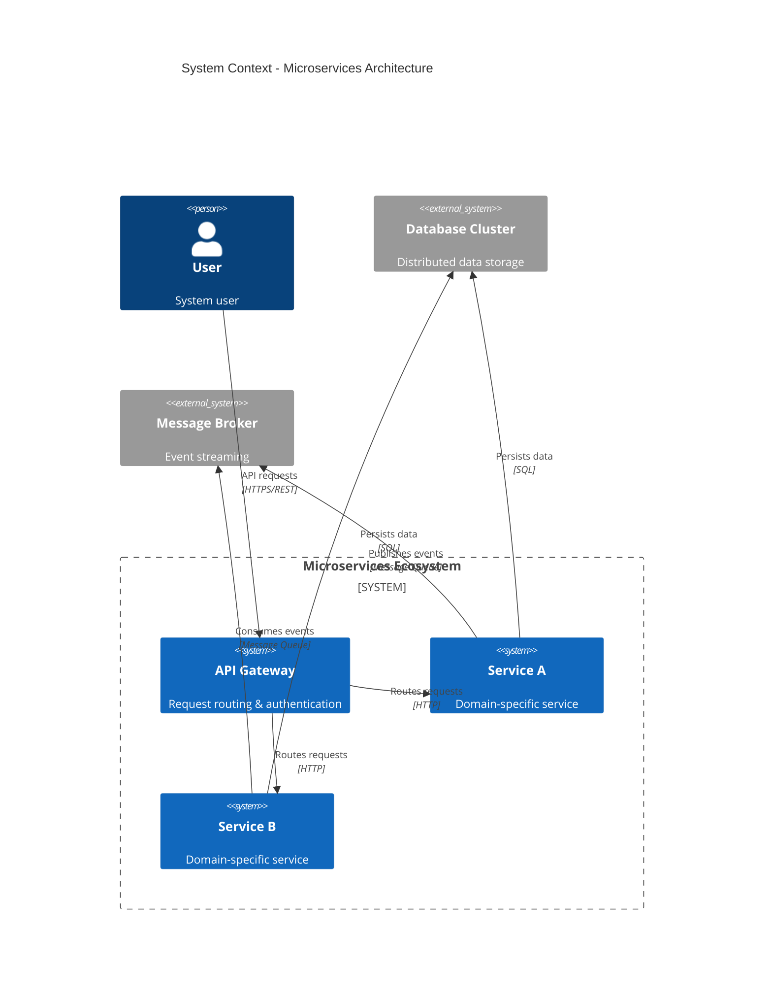
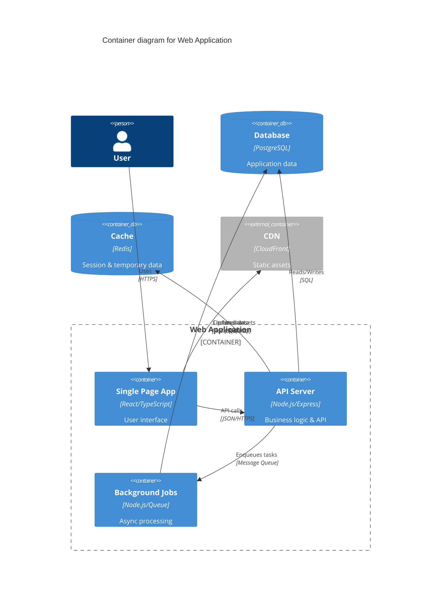
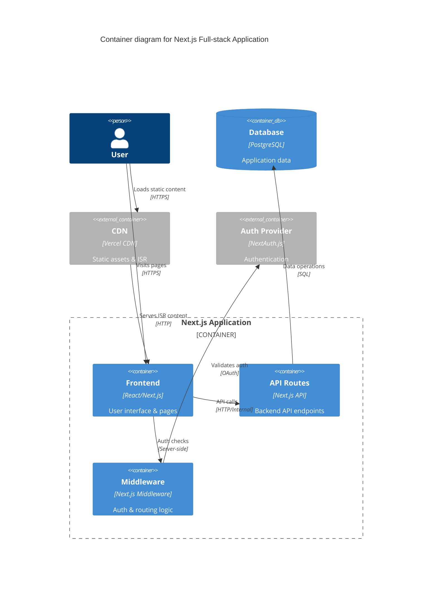
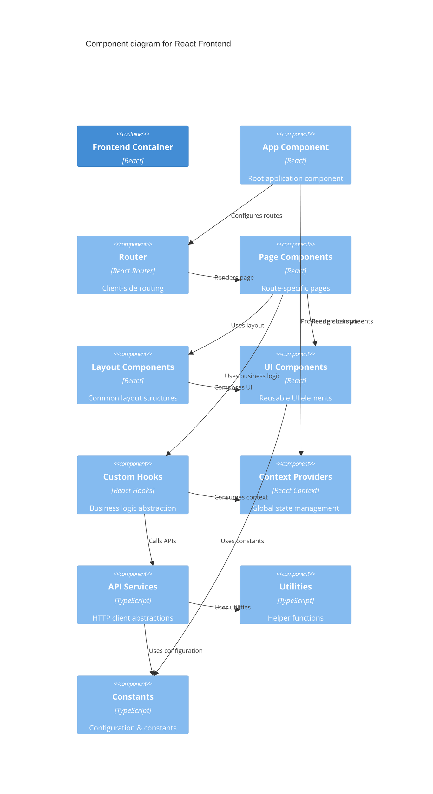
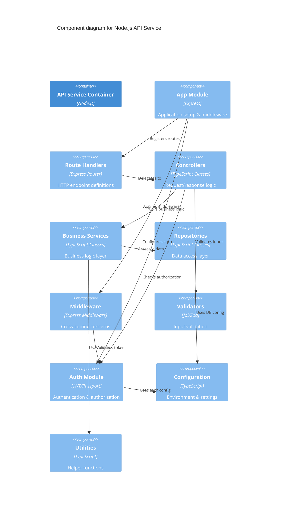

# 🎭 C4 Mermaid Patterns - Sistema Onion

## 📋 **Mermaid C4 Syntax Reference**

Padrões específicos para geração de diagramas C4 em Mermaid, focados em compatibilidade GitHub.

---

## 🎨 **Context Diagram Patterns**

### **Basic Context Pattern**


### **Multi-User Context Pattern**


### **Microservices Context Pattern**


---

## 🏗️ **Container Diagram Patterns**

### **Web Application Container Pattern**


### **Monorepo Container Pattern**
```mermaid
C4Container
    title Container diagram for NX Monorepo
    
    Person(developer, "Developer")
    Person(user, "End User")
    
    Container_Boundary(nx_workspace, "NX Monorepo Workspace") {
        Container(web_app, "Web App", "React", "Main user application")
        Container(admin_app, "Admin App", "React", "Administrative interface")
        Container(mobile_app, "Mobile App", "React Native", "Mobile application")
        Container(api_service, "API Service", "NestJS", "Backend API")
        Container(shared_libs, "Shared Libraries", "TypeScript", "Common utilities")
    }
    
    ContainerDb(database, "Database", "PostgreSQL", "Application data")
    Container_Ext(registry, "Package Registry", "npm/private", "Package distribution")
    
    Rel(developer, nx_workspace, "Develops", "NX CLI")
    Rel(user, web_app, "Uses", "HTTPS")
    Rel(user, mobile_app, "Uses", "Mobile App")
    Rel(web_app, shared_libs, "Imports", "ES Modules")
    Rel(admin_app, shared_libs, "Imports", "ES Modules")
    Rel(mobile_app, shared_libs, "Imports", "ES Modules")
    Rel(api_service, shared_libs, "Imports", "ES Modules")
    Rel(web_app, api_service, "API calls", "HTTPS/REST")
    Rel(admin_app, api_service, "API calls", "HTTPS/REST")
    Rel(mobile_app, api_service, "API calls", "HTTPS/REST")
    Rel(api_service, database, "Persists data", "SQL")
    Rel(shared_libs, registry, "Published to", "npm publish")
```

### **Full-stack Container Pattern**


---

## 🧩 **Component Diagram Patterns**

### **React Component Structure Pattern**


### **API Service Component Pattern**


---

## 🎯 **Pattern Selection Rules**

### **Context Level Selection**
```typescript
const contextPatterns = {
  'single-user-spa': 'basic-context-pattern',
  'multi-user-app': 'multi-user-context-pattern',
  'microservices': 'microservices-context-pattern',
  'monolith': 'basic-context-pattern',
  'serverless': 'serverless-context-pattern'
}
```

### **Container Level Selection**
```typescript
const containerPatterns = {
  'spa-with-api': 'web-application-container-pattern',
  'monorepo-nx': 'monorepo-container-pattern',
  'nextjs-fullstack': 'fullstack-container-pattern',
  'microservices': 'microservices-container-pattern',
  'api-only': 'api-service-container-pattern'
}
```

### **Component Level Selection**
```typescript
const componentPatterns = {
  'react-frontend': 'react-component-structure-pattern',
  'vue-frontend': 'vue-component-structure-pattern',
  'node-api': 'api-service-component-pattern',
  'nestjs-api': 'nestjs-component-pattern',
  'express-api': 'express-component-pattern'
}
```

---

## 🔧 **Mermaid Optimization Rules**

### **GitHub Compatibility**
```yaml
github_optimizations:
  max_diagram_size: '2MB'
  recommended_nodes: '< 20 per diagram'
  text_length: '< 50 chars per label'
  
  avoid:
    - Complex nested boundaries
    - Too many relationship lines
    - Very long descriptions
    
  prefer:
    - Simple, clear node names
    - Consistent styling
    - Logical grouping with boundaries
```

### **Performance Guidelines**
```yaml
performance_rules:
  context_diagrams:
    max_systems: 8
    max_actors: 4
    max_relationships: 12
    
  container_diagrams:
    max_containers: 12
    max_databases: 4
    max_external_systems: 6
    
  component_diagrams:
    max_components: 15
    max_relationships: 20
    recommended_depth: 1  # Avoid nested components
```

### **Styling Consistency**
```yaml
styling_patterns:
  colors:
    person: '#08427B'
    system: '#1168BD'
    system_ext: '#999999'
    container: '#438DD5'
    component: '#85BBF0'
    database: '#F2F2F2'
    
  node_naming:
    use_snake_case: true
    max_length: 20
    avoid_special_chars: true
    
  relationship_labels:
    action_oriented: 'Uses, Calls, Sends, Reads'
    include_protocol: 'HTTPS, REST, SQL'
    max_length: 30
```

---

**Patterns**: 🎭 **GitHub-Optimized & Performance-Tuned**  
**Compatibility**: Testado com GitHub Mermaid rendering  
**Performance**: Otimizado para diagramas < 2MB  
**Quality**: Templates seguem melhores práticas C4 Model
