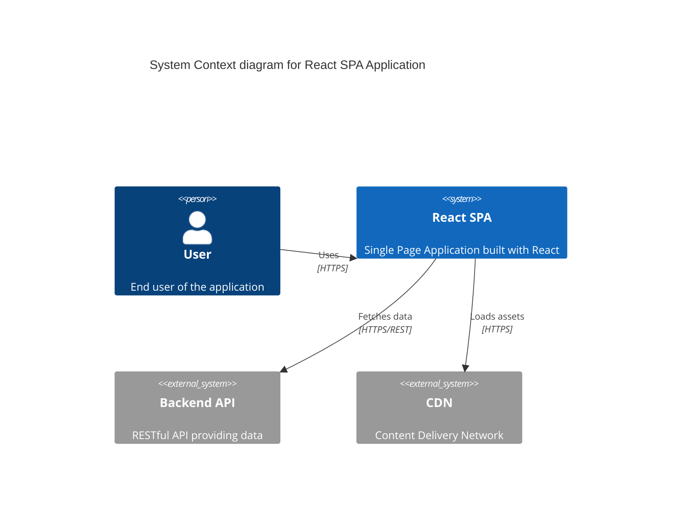
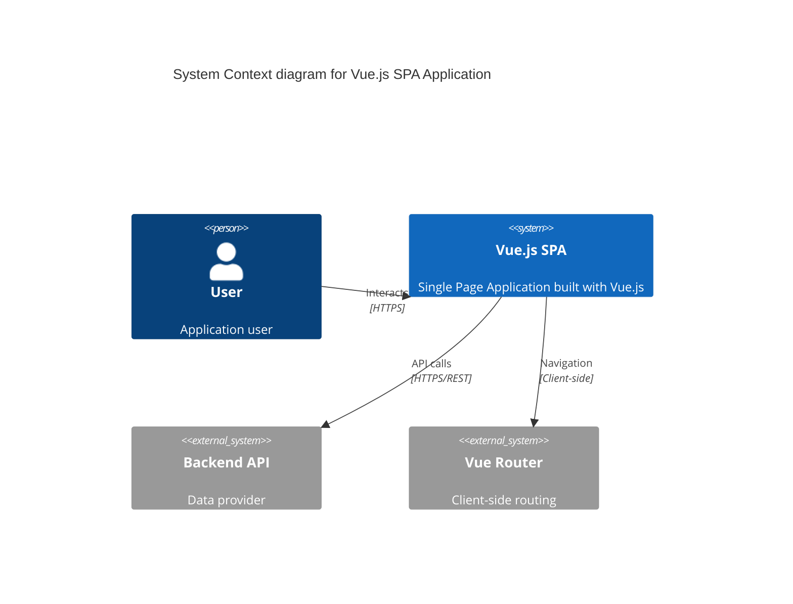
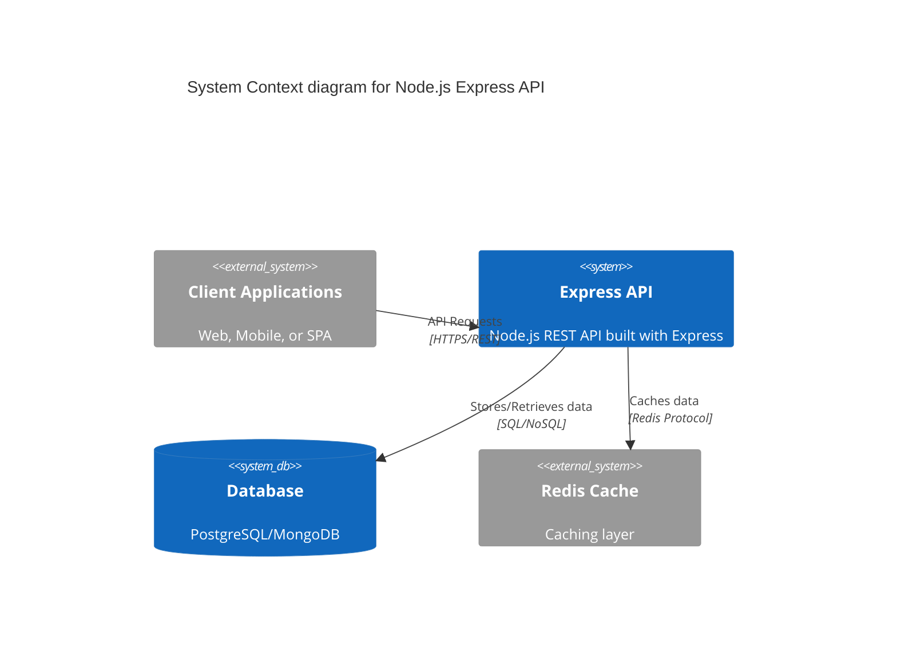
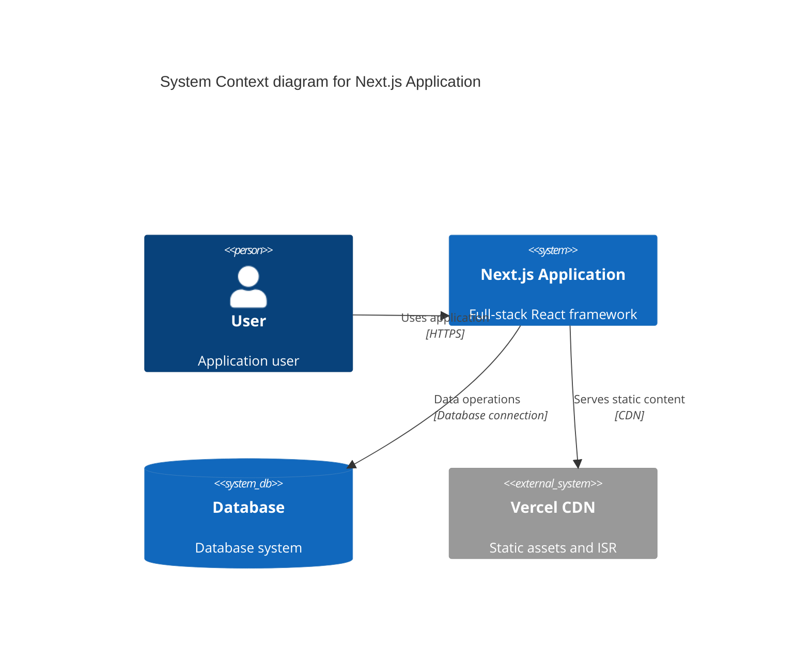
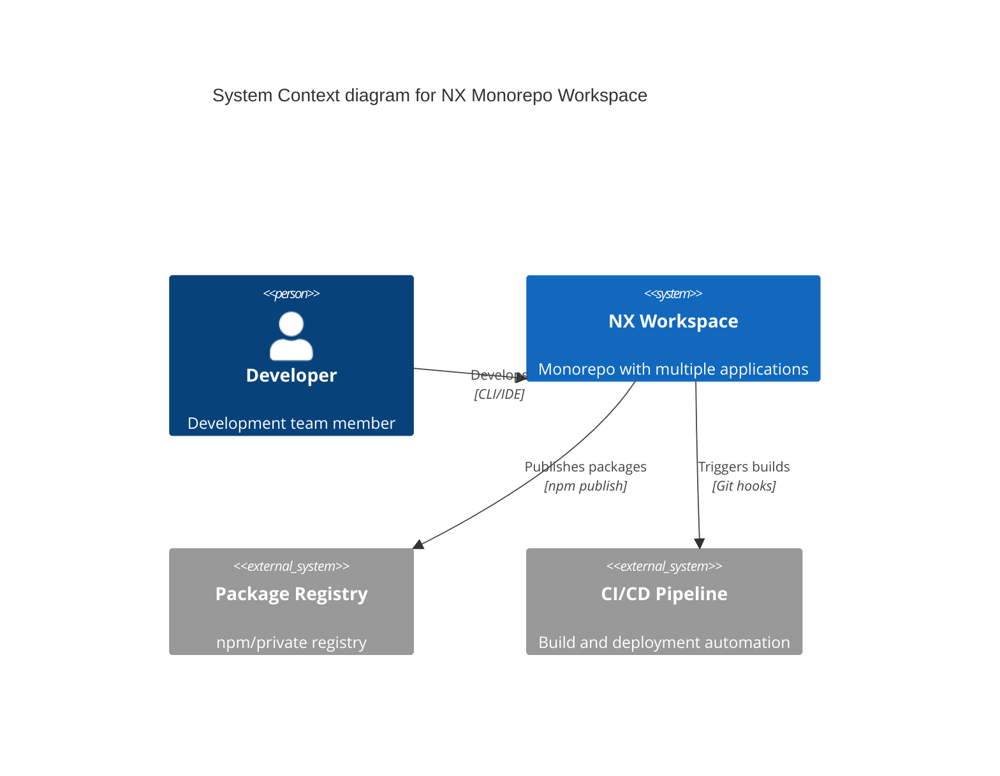
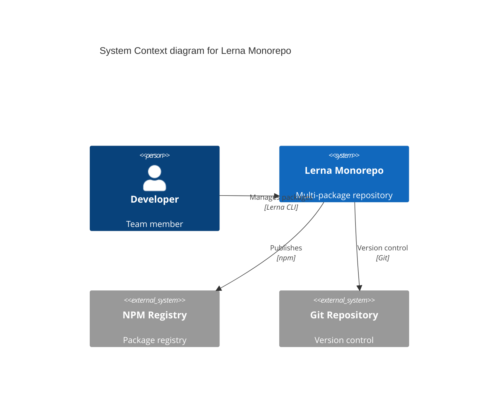
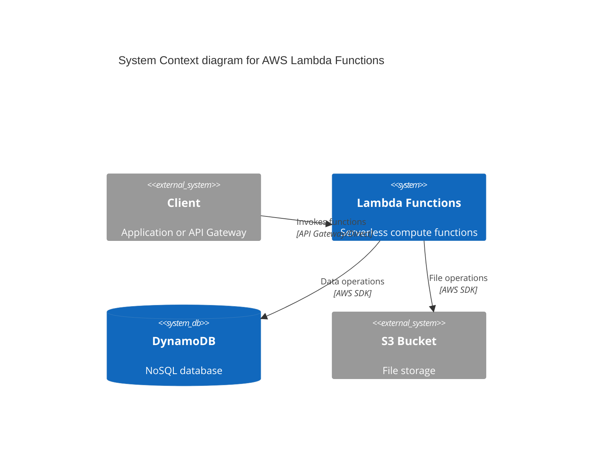
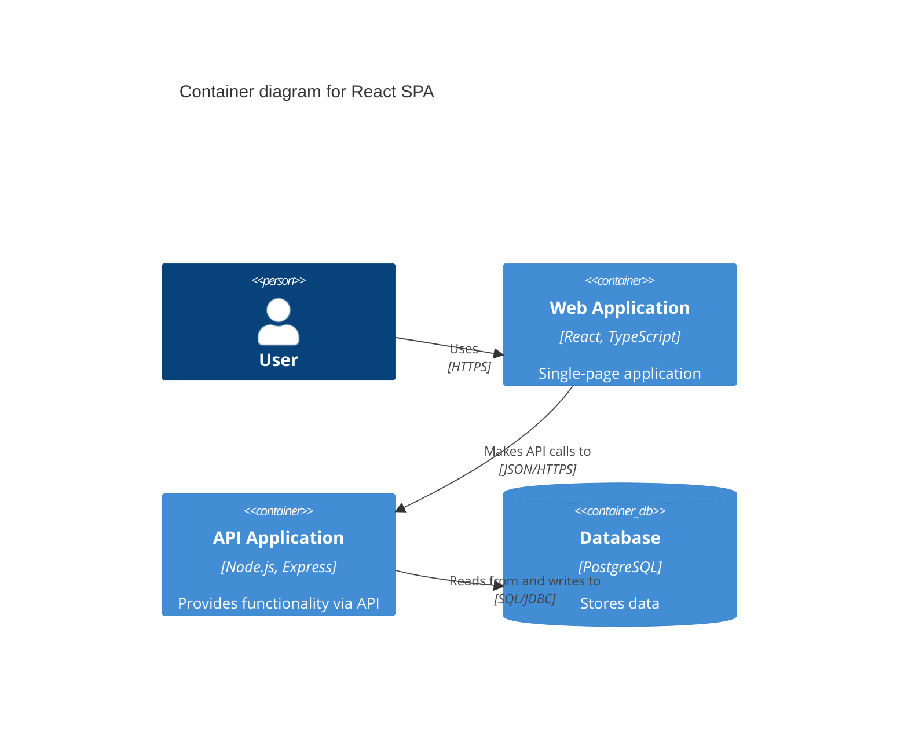
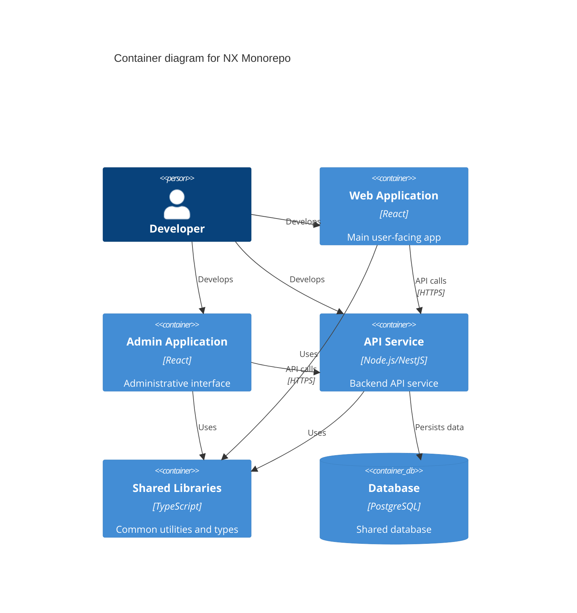
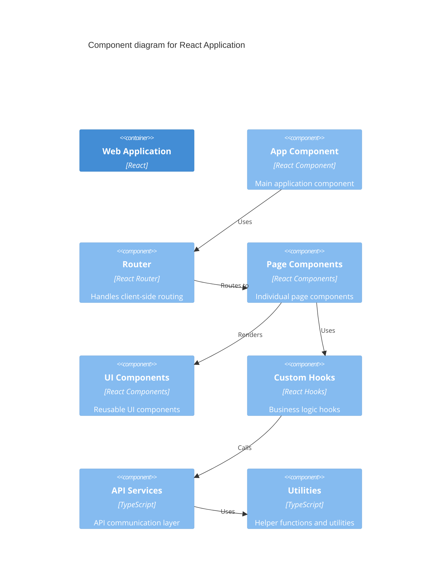

# 🎨 C4 Templates - Sistema Onion

## 📋 **Template Strategy**

Templates Mermaid C4 adaptativos para diferentes tipos de projeto. Seguindo a estratégia "Cebola" (núcleo → abstração).

---

## 🏢 **Single Page Application (SPA) Templates**

### **React SPA Template**


### **Vue.js SPA Template**


---

## 🔌 **API Service Templates**

### **Node.js Express API Template**


### **NestJS API Template**


---

## 🌐 **Full-stack Application Templates**

### **Next.js Full-stack Template**


---

## 📦 **Monorepo Templates**

### **NX Monorepo Template**


### **Lerna Monorepo Template**


---

## ☁️ **Serverless Templates**

### **AWS Lambda Template**


---

## 🎯 **Container Level Templates**

### **React SPA Container Diagram**


### **Monorepo Container Diagram**


---

## 🧩 **Component Level Templates**

### **React Component Structure**


---

## 🔧 **Template Selection Logic**

### **Detection Patterns**
```typescript
// Template selection based on project detection
const templateMappingRules = {
  // SPA Projects
  'spa-react': {
    contextTemplate: 'react-spa-context',
    containerTemplate: 'spa-container-diagram',
    componentTemplate: 'react-component-structure'
  },
  
  // API Projects
  'node-api': {
    contextTemplate: 'nodejs-api-context', 
    containerTemplate: 'api-service-containers',
    componentTemplate: 'api-layered-components'
  },
  
  // Monorepo Projects
  'nx-monorepo': {
    contextTemplate: 'nx-workspace-context',
    containerTemplate: 'monorepo-container-diagram', 
    componentTemplate: 'nx-lib-components'
  }
  
  // ... more mappings
}
```

---

**Templates**: 🎨 **Adaptive & Project-Aware**  
**Strategy**: Seleção automática baseada em detecção de projeto  
**Fallback**: Template genérico quando tipo não identificado  
**Extensibilidade**: Novos templates facilmente adicionáveis
