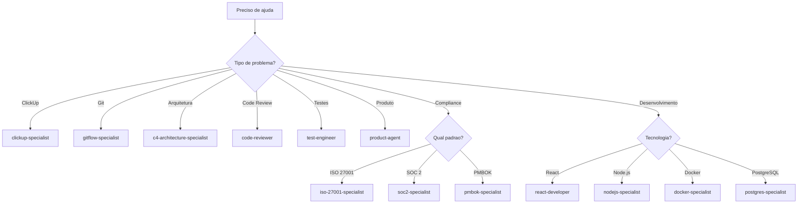

# 🤖 Referência de Agentes - Sistema Onion

## 📋 Índice

- [Visão Geral](#-visão-geral)
- [Agentes de Desenvolvimento](#-agentes-de-desenvolvimento)
- [Agentes de Produto](#-agentes-de-produto)
- [Agentes de Compliance](#-agentes-de-compliance)
- [Agentes de Dados](#-agentes-de-dados)
- [Agentes de Deployment](#-agentes-de-deployment)
- [Agentes Meta](#-agentes-meta)
- [Agentes de Review](#-agentes-de-review)
- [Agentes Raiz](#-agentes-raiz)
- [Matriz de Decisão](#-matriz-de-decisão)

---

## 🎯 Visão Geral

O Sistema Onion oferece **38 agentes especializados** organizados por categoria funcional. Cada agente é um expert em seu domínio e pode ser invocado com `@nome-do-agente`.

### 🧅 Agente Principal: @onion
**O orquestrador master do Sistema Onion** - ponto de entrada inteligente que conhece todos os 38 agentes, 56 comandos e toda a documentação. Use `@onion` quando precisar de:
- Navegação e orientação no sistema
- Recomendações de comandos/agentes apropriados
- Orquestração de workflows complexos
- Troubleshooting geral
- Coordenação de tarefas multi-etapas

### Como Usar Agentes
```bash
# Sintaxe básica
@nome-do-agente "sua pergunta ou solicitação"

# Exemplo
@clickup-specialist "Como otimizar bulk operations?"
```

### Categorias de Agentes
- 🧅 **Principal** (1 agente): Orquestrador master do sistema
- 🔧 **Desenvolvimento** (15 agentes): Código, arquitetura, ferramentas
- 📦 **Produto** (3 agentes): Gestão de produto, storytelling
- ✅ **Compliance** (5 agentes): ISO, SOC2, PMBOK, segurança
- 💾 **Dados** (1 agente): Bancos de dados
- 🚀 **Deployment** (1 agente): Docker, containers
- 🔧 **Meta** (2 agentes): Criação de agentes e comandos
- 📝 **Review** (1 agente): Compliance corporativa
- 🌟 **Raiz** (9 agentes): Agentes gerais e especializados

---

## 🧅 Agente Principal

### @onion
**Especialidade:** Orquestrador master do Sistema Onion

**Quando usar:**
- Navegação e orientação no sistema
- Dúvidas sobre comandos ou agentes
- Recomendações de melhor abordagem
- Orquestração de workflows complexos
- Troubleshooting geral
- Coordenação de tarefas multi-etapas
- Qualquer dúvida sobre o Sistema Onion

**Exemplo:**
```bash
@onion "Como desenvolver uma feature completa do zero?"
@onion "Qual comando usar para criar uma task no ClickUp?"
@onion "Preciso otimizar minhas operações de bulk"
```

**Capacidades:**
- ✅ Conhecimento completo: 38 agentes, 56 comandos, toda documentação
- ✅ Análise inteligente de contexto
- ✅ Recomendação de comandos/agentes apropriados
- ✅ Orquestração de workflows end-to-end
- ✅ Delegação para agentes especializados
- ✅ Integração com ClickUp MCP
- ✅ Troubleshooting e diagnóstico
- ✅ Alta autonomia e execução proativa

**Diferencial:**
O `@onion` é o **ponto de entrada inteligente** do Sistema Onion. Ele analisa sua solicitação, identifica a melhor solução (comando, agente ou workflow) e orquestra a execução completa. Use-o quando não souber por onde começar ou precisar coordenar tarefas complexas.

---

## 🔧 Agentes de Desenvolvimento

### @clickup-specialist
**Especialidade:** Otimizações técnicas do ClickUp MCP

**Quando usar:**
- Otimizar bulk operations
- Resolver problemas de hierarquia
- Melhorar performance de API calls
- Troubleshooting de integração

**Exemplo:**
```bash
@clickup-specialist "Como criar hierarquia correta de tasks?"
```

**Capacidades:**
- ✅ Bulk operations otimizadas
- ✅ Hierarquia de tasks (parent/child)
- ✅ Formatação de descriptions e comments
- ✅ Checklists nativos
- ✅ Performance tuning

---

### @gitflow-specialist
**Especialidade:** Git e GitFlow workflows

**Quando usar:**
- Configurar GitFlow
- Resolver conflitos de merge
- Otimizar branching strategy
- Troubleshooting Git

**Exemplo:**
```bash
@gitflow-specialist "Qual estratégia de branching para este projeto?"
```

**Capacidades:**
- ✅ GitFlow setup e configuração
- ✅ Branching strategies
- ✅ Merge conflict resolution
- ✅ Git best practices
- ✅ Repository analysis

---

### @task-specialist
**Especialidade:** Decomposição hierárquica de tasks

**Quando usar:**
- Quebrar tasks complexas
- Criar estrutura de subtasks
- Definir action items
- Estimar esforço

**Exemplo:**
```bash
@task-specialist "Decompor feature de autenticação JWT"
```

**Capacidades:**
- ✅ Decomposição inteligente
- ✅ Patterns (Feature/Bug/Tech Debt/Research)
- ✅ Estimativas de esforço
- ✅ Critérios de aceitação
- ✅ Dependency mapping

---

### @c4-architecture-specialist
**Especialidade:** Diagramas C4 Model de arquitetura

**Quando usar:**
- Documentar arquitetura
- Criar diagramas C4
- Análise de componentes
- Design de sistemas

**Exemplo:**
```bash
@c4-architecture-specialist "Criar diagrama C4 do sistema de autenticação"
```

**Capacidades:**
- ✅ Context diagrams
- ✅ Container diagrams
- ✅ Component diagrams
- ✅ Code diagrams
- ✅ Mermaid integration

---

### @c4-documentation-specialist
**Especialidade:** Documentação de arquitetura C4

**Quando usar:**
- Documentar decisões arquiteturais
- Criar ADRs (Architecture Decision Records)
- Documentar componentes
- Manter docs atualizados

**Exemplo:**
```bash
@c4-documentation-specialist "Documentar decisão de usar JWT"
```

---

### @cursor-specialist
**Especialidade:** Problemas e configuração do Cursor IDE

**Quando usar:**
- Troubleshooting do Cursor
- Configurar workspace
- Otimizar performance
- Resolver problemas de indexação

**Exemplo:**
```bash
@cursor-specialist "Cursor está lento, como otimizar?"
```

---

### @mermaid-specialist
**Especialidade:** Diagramas Mermaid

**Quando usar:**
- Criar diagramas de fluxo
- Diagramas de sequência
- Diagramas de classes
- Visualizações técnicas

**Exemplo:**
```bash
@mermaid-specialist "Criar diagrama de sequência do fluxo de autenticação"
```

---

### @nodejs-specialist
**Especialidade:** Node.js e JavaScript/TypeScript

**Quando usar:**
- Desenvolvimento Node.js
- Troubleshooting de código
- Best practices JavaScript
- Performance tuning

**Exemplo:**
```bash
@nodejs-specialist "Como implementar JWT em Node.js?"
```

---

### @nx-monorepo-specialist
**Especialidade:** Nx monorepo architecture

**Quando usar:**
- Configurar Nx workspace
- Organizar libs e apps
- Otimizar build
- Dependency graph

**Exemplo:**
```bash
@nx-monorepo-specialist "Como organizar libs no Nx?"
```

---

### @nx-migration-specialist
**Especialidade:** Migração para Nx

**Quando usar:**
- Migrar projeto para Nx
- Planejar migração
- Resolver problemas de migração
- Otimizar estrutura

**Exemplo:**
```bash
@nx-migration-specialist "Plano de migração de monorepo para Nx"
```

---

### @gamma-api-specialist
**Especialidade:** Gamma API integration

**Quando usar:**
- Integrar com Gamma API
- Troubleshooting de API
- Otimizar chamadas
- Documentação de API

**Exemplo:**
```bash
@gamma-api-specialist "Como autenticar na Gamma API?"
```

---

### @linux-security-specialist
**Especialidade:** Segurança Linux

**Quando usar:**
- Hardening de servidores
- Configuração de firewall
- Auditoria de segurança
- Best practices Linux

**Exemplo:**
```bash
@linux-security-specialist "Como configurar firewall UFW?"
```

---

### @docs-reverse-engineer
**Especialidade:** Engenharia reversa de documentação

**Quando usar:**
- Gerar docs de código existente
- Documentar sistemas legados
- Extrair conhecimento de código
- Criar documentação técnica

**Exemplo:**
```bash
@docs-reverse-engineer "Gerar documentação deste módulo"
```

---

### @system-documentation-orchestrator
**Especialidade:** Orquestração de documentação de sistemas

**Quando usar:**
- Coordenar geração de docs
- Estruturar documentação
- Manter consistência
- Automatizar processos de docs

**Exemplo:**
```bash
@system-documentation-orchestrator "Gerar documentação completa do sistema"
```

---

## 📦 Agentes de Produto

### @product-agent
**Especialidade:** Gestão estratégica de produto e ClickUp

**Quando usar:**
- Planejamento estratégico
- Priorização de features
- Roadmap de produto
- Gestão de tasks ClickUp

**Exemplo:**
```bash
@product-agent "Priorizar features do próximo sprint"
```

**Capacidades:**
- ✅ Estratégia de produto
- ✅ Gestão ClickUp
- ✅ Priorização
- ✅ Roadmap planning
- ✅ Stakeholder management

---

### @storytelling-business-specialist
**Especialidade:** Storytelling e comunicação de negócio

**Quando usar:**
- Criar apresentações
- Comunicar valor de negócio
- Storytelling de features
- Documentação de negócio

**Exemplo:**
```bash
@storytelling-business-specialist "Criar apresentação da nova feature"
```

---

### @presentation-orchestrator
**Especialidade:** Orquestração de apresentações

**Quando usar:**
- Coordenar criação de apresentações
- Estruturar conteúdo
- Integrar múltiplas fontes
- Automatizar geração

**Exemplo:**
```bash
@presentation-orchestrator "Gerar apresentação executiva do projeto"
```

---

## ✅ Agentes de Compliance

### @iso-27001-specialist
**Especialidade:** ISO 27001 (Segurança da Informação)

**Quando usar:**
- Implementar ISO 27001
- Auditoria de segurança
- Documentação de compliance
- Risk assessment

**Exemplo:**
```bash
@iso-27001-specialist "Como implementar controles ISO 27001?"
```

---

### @iso-22301-specialist
**Especialidade:** ISO 22301 (Continuidade de Negócio)

**Quando usar:**
- Business continuity planning
- Disaster recovery
- Risk management
- Compliance ISO 22301

**Exemplo:**
```bash
@iso-22301-specialist "Criar plano de continuidade de negócio"
```

---

### @soc2-specialist
**Especialidade:** SOC 2 compliance

**Quando usar:**
- Implementar SOC 2
- Auditoria SOC 2
- Documentação de controles
- Preparação para certificação

**Exemplo:**
```bash
@soc2-specialist "Quais controles SOC 2 implementar?"
```

---

### @pmbok-specialist
**Especialidade:** PMBOK (Project Management)

**Quando usar:**
- Gestão de projetos
- Planejamento PMBOK
- Documentação de projeto
- Best practices PM

**Exemplo:**
```bash
@pmbok-specialist "Criar plano de projeto seguindo PMBOK"
```

---

### @security-information-master
**Especialidade:** Master em segurança da informação

**Quando usar:**
- Estratégia de segurança
- Arquitetura de segurança
- Compliance geral
- Risk management

**Exemplo:**
```bash
@security-information-master "Estratégia de segurança para o projeto"
```

---

## 💾 Agentes de Dados

### @postgres-specialist
**Especialidade:** PostgreSQL database

**Quando usar:**
- Design de schema
- Otimização de queries
- Performance tuning
- Troubleshooting PostgreSQL

**Exemplo:**
```bash
@postgres-specialist "Otimizar query lenta no PostgreSQL"
```

---

## 🚀 Agentes de Deployment

### @docker-specialist
**Especialidade:** Docker e containers

**Quando usar:**
- Criar Dockerfiles
- Docker Compose
- Otimizar images
- Troubleshooting containers

**Exemplo:**
```bash
@docker-specialist "Criar Dockerfile otimizado para Node.js"
```

---

## 🔧 Agentes Meta

### @agent-creator-specialist
**Especialidade:** Criação de novos agentes

**Quando usar:**
- Criar agente customizado
- Definir especialidade
- Estruturar agente
- Best practices de agentes

**Exemplo:**
```bash
@agent-creator-specialist "Criar agente especializado em GraphQL"
```

---

### @command-creator-specialist
**Especialidade:** Criação de novos comandos

**Quando usar:**
- Criar comando customizado
- Estruturar workflow
- Definir parâmetros
- Best practices de comandos

**Exemplo:**
```bash
@command-creator-specialist "Criar comando para deploy automatizado"
```

---

## 📝 Agentes de Review

### @corporate-compliance-specialist
**Especialidade:** Compliance corporativa

**Quando usar:**
- Review de compliance
- Auditoria corporativa
- Políticas e procedimentos
- Governance

**Exemplo:**
```bash
@corporate-compliance-specialist "Review de compliance do projeto"
```

---

## 🌟 Agentes Raiz

### @code-reviewer
**Especialidade:** Code review geral

**Quando usar:**
- Review de código
- Identificar code smells
- Sugerir melhorias
- Best practices

**Exemplo:**
```bash
@code-reviewer "Review deste módulo de autenticação"
```

---

### @react-developer
**Especialidade:** Desenvolvimento React

**Quando usar:**
- Desenvolvimento React
- Troubleshooting React
- Best practices React
- Performance tuning

**Exemplo:**
```bash
@react-developer "Como otimizar re-renders no React?"
```

---

### @test-engineer
**Especialidade:** Engenharia de testes

**Quando usar:**
- Criar estratégia de testes
- Implementar testes
- Test automation
- Quality assurance

**Exemplo:**
```bash
@test-engineer "Criar estratégia de testes para autenticação"
```

---

### @test-planner
**Especialidade:** Planejamento de testes

**Quando usar:**
- Planejar suíte de testes
- Definir casos de teste
- Test coverage
- Test strategy

**Exemplo:**
```bash
@test-planner "Planejar testes para feature de pagamentos"
```

---

### @research-agent
**Especialidade:** Pesquisa e análise

**Quando usar:**
- Pesquisar tecnologias
- Análise de alternativas
- Proof of concepts
- Technology evaluation

**Exemplo:**
```bash
@research-agent "Comparar JWT vs Session-based auth"
```

---

### @metaspec-gate-keeper
**Especialidade:** Validação de meta-especificações

**Quando usar:**
- Validar arquitetura
- Review de decisões
- Gate keeping de qualidade
- Compliance arquitetural

**Exemplo:**
```bash
@metaspec-gate-keeper "Validar arquitetura proposta"
```

---

### @branch-code-reviewer
**Especialidade:** Code review de branches

**Quando usar:**
- Review de branch completa
- Análise de mudanças
- Pre-merge validation
- Quality gates

**Exemplo:**
```bash
@branch-code-reviewer "Review da branch feature/jwt-auth"
```

---

### @branch-documentation-writer
**Especialidade:** Documentação de branches

**Quando usar:**
- Documentar mudanças de branch
- Gerar changelog
- Documentar features
- Release notes

**Exemplo:**
```bash
@branch-documentation-writer "Documentar mudanças da branch"
```

---

### @branch-metaspec-checker
**Especialidade:** Validação de meta-specs em branches

**Quando usar:**
- Validar compliance de branch
- Check de meta-specs
- Architectural validation
- Pre-merge checks

**Exemplo:**
```bash
@branch-metaspec-checker "Validar compliance da branch"
```

---

### @branch-test-planner
**Especialidade:** Planejamento de testes para branches

**Quando usar:**
- Planejar testes de branch
- Definir test strategy
- Test coverage analysis
- Pre-merge testing

**Exemplo:**
```bash
@branch-test-planner "Planejar testes para esta branch"
```

---

## 🤔 Matriz de Decisão

### Quando usar cada agente?

| Situação | Agente Recomendado | Razão |
|----------|-------------------|-------|
| Criar task estruturada | @task-specialist | Decomposição hierárquica |
| Otimizar ClickUp | @clickup-specialist | Expert em ClickUp MCP |
| Problemas Git | @gitflow-specialist | Expert em GitFlow |
| Documentar arquitetura | @c4-architecture-specialist | Diagramas C4 |
| Code review | @code-reviewer | Review geral |
| Testes | @test-engineer | Estratégia de testes |
| React | @react-developer | Expert React |
| Node.js | @nodejs-specialist | Expert Node.js |
| Docker | @docker-specialist | Expert containers |
| PostgreSQL | @postgres-specialist | Expert database |
| Segurança | @security-information-master | Estratégia de segurança |
| ISO 27001 | @iso-27001-specialist | Compliance ISO |
| SOC 2 | @soc2-specialist | Compliance SOC 2 |
| Produto | @product-agent | Estratégia de produto |
| Criar agente | @agent-creator-specialist | Meta-criação |
| Criar comando | @command-creator-specialist | Meta-criação |

### Fluxo de Decisão



---

## 💡 Best Practices

### 1. Escolha o agente mais específico
```bash
# ❌ Genérico
@code-reviewer "Como fazer autenticação?"

# ✅ Específico
@nodejs-specialist "Como implementar JWT em Node.js?"
```

### 2. Forneça contexto adequado
```bash
# ❌ Vago
@clickup-specialist "Ajuda com tasks"

# ✅ Específico
@clickup-specialist "Como criar hierarquia de tasks com parent/child?"
```

### 3. Use múltiplos agentes quando apropriado
```bash
# Para feature complexa:
@task-specialist "Decompor feature"
@c4-architecture-specialist "Documentar arquitetura"
@test-engineer "Criar estratégia de testes"
```

### 4. Combine com comandos
```bash
# Workflow completo:
/product/task "Nova feature"
@task-specialist "Refinar decomposição"
/engineer/start feature-name
@c4-architecture-specialist "Documentar decisões"
```

---

## 🔗 Documentos Relacionados

- [Guia de Comandos](./commands-guide.md) - Comandos que invocam agentes
- [Fluxos de Engenharia](./engineering-flows.md) - Workflows com agentes
- [Exemplos Práticos](./practical-examples.md) - Casos de uso com agentes
- [Configuração Inicial](./getting-started.md) - Setup de agentes

---

**Última atualização:** 2025-01-27  
**Versão:** 2.0  
**Total de Agentes:** 37

