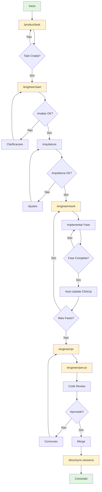
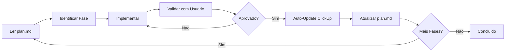
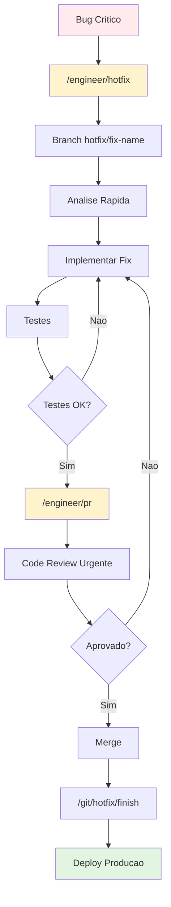
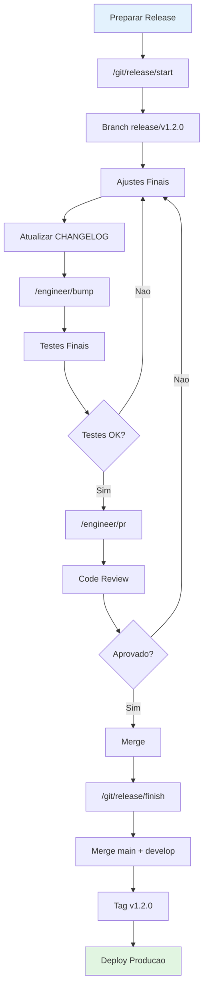
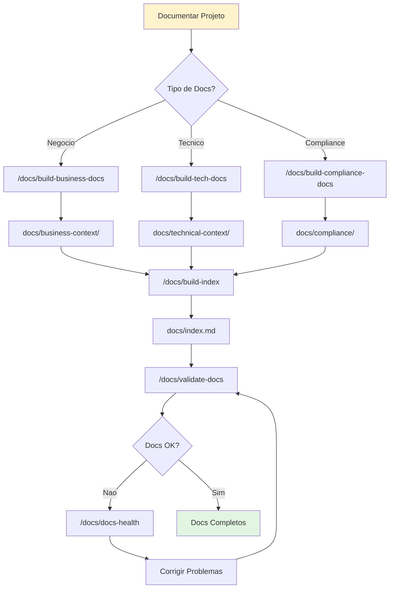
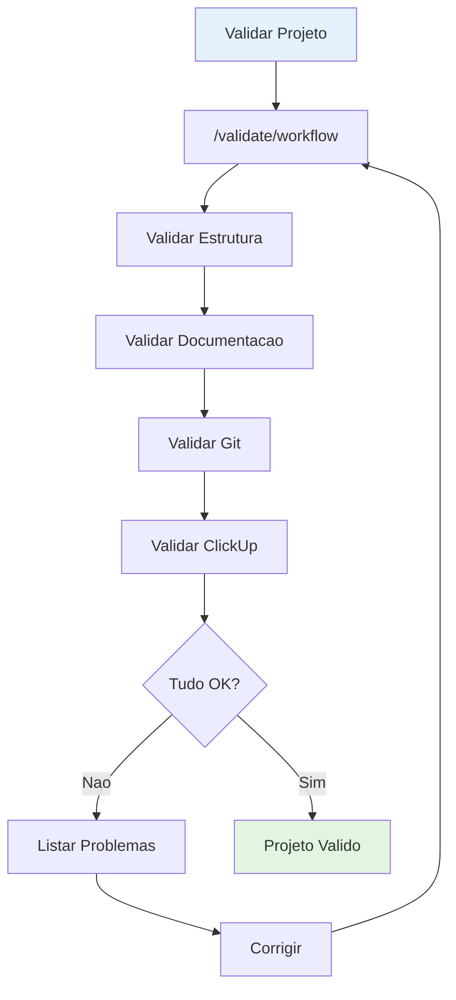
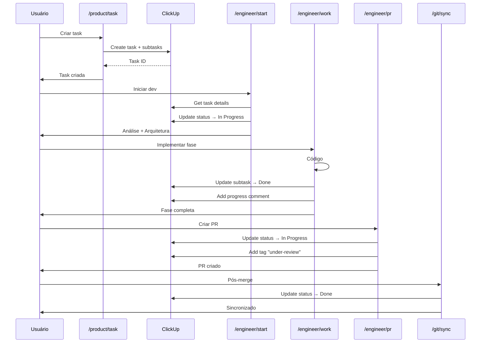
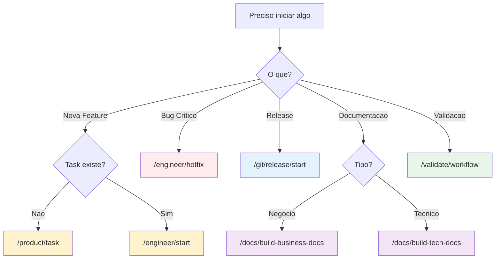
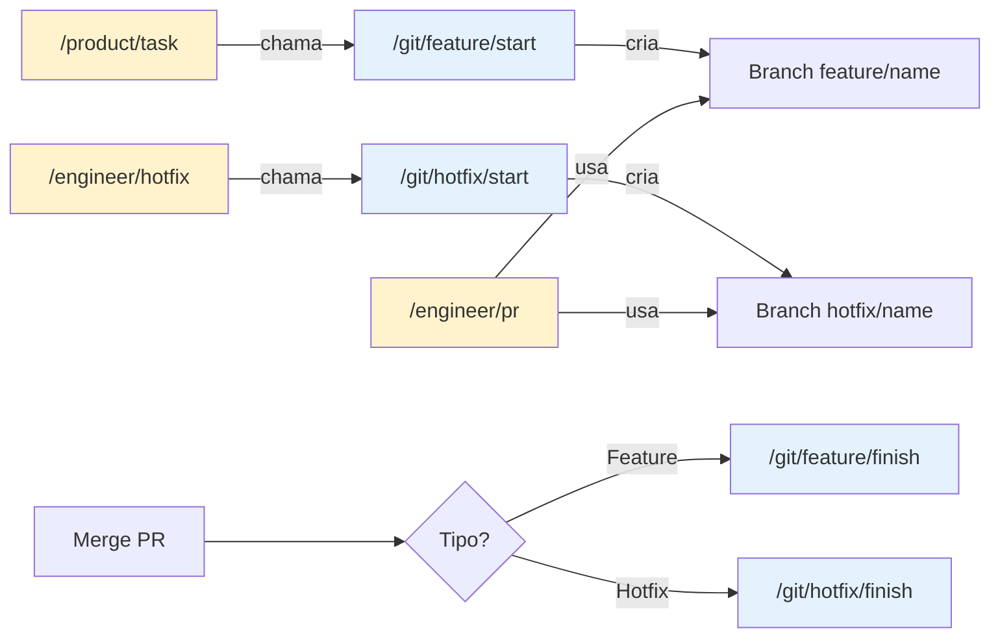

# 🔄 Fluxos de Engenharia - Sistema Onion

## 📋 Índice

- [Visão Geral](#-visão-geral)
- [Fluxo Completo de Feature](#-fluxo-completo-de-feature)
- [Fluxo de Hotfix](#-fluxo-de-hotfix)
- [Fluxo de Release](#-fluxo-de-release)
- [Fluxo de Documentação](#-fluxo-de-documentação)
- [Fluxo de Validação](#-fluxo-de-validação)
- [Integração entre Comandos](#-integração-entre-comandos)
- [Decision Trees](#-decision-trees)
- [Troubleshooting](#-troubleshooting)
- [Fluxos Git (Avançado)](#-fluxos-git-avançado)
- [Documentos Relacionados](#-documentos-relacionados)

---

## 🎯 Visão Geral

O Sistema Onion oferece workflows automatizados centrados em **comandos de engenharia** (`/engineer/*`) e **produto** (`/product/*`), com integração automática ao ClickUp e Git. Todos os fluxos seguem o padrão de nomenclatura `<feature-slug>` (kebab-case).

### Princípios dos Fluxos

1. **Engineering-First**: Comandos `/engineer/*` são o core do desenvolvimento
2. **Product-Driven**: `/product/*` gerencia tasks e planejamento estratégico
3. **Automação Inteligente**: Git e ClickUp são gerenciados automaticamente
4. **Session Management**: Contexto preservado em `.claude/sessions/`
5. **Documentação Automática**: Geração de docs durante desenvolvimento

### Hierarquia de Comandos

```
🎯 CORE (Prioridade Máxima)
├── /product/*        # Gestão de produto e tasks
└── /engineer/*       # Desenvolvimento e implementação

⚙️ SUPORTE (Automáticos)
├── /docs/*          # Documentação e sessões
└── /git/*           # Git (usado internamente pelos comandos core)
```

---

## 🚀 Fluxo Completo de Feature

### Visão Geral

Fluxo end-to-end para desenvolvimento de uma nova funcionalidade, desde a criação da task até o merge final.

### Diagrama do Fluxo



### Passo a Passo Detalhado

#### 1. Criação da Task (`/product/task`)

```bash
/product/task "Implementar autenticação JWT com refresh tokens"
```

**O que acontece:**

1. ✅ Análise de documentação (README.md, docs/)
2. ✅ Identificação de complexidade e pattern
3. ✅ Apresentação do plano para confirmação
4. ✅ Criação no ClickUp (Task + Subtasks + Action Items)
5. ✅ Integração Git automática (`/git/feature/start` ou branch direta)
6. ✅ Setup de sessão (`.claude/sessions/<feature-slug>/`)
7. ✅ Criação de context files

**Saída:**

```
📋 Task: 86acu8pdk
🌿 Branch: feature/jwt-authentication
📁 Sessão: .claude/sessions/jwt-authentication/
```

---

#### 2. Início do Desenvolvimento (`/engineer/start`)

```bash
/engineer/start jwt-authentication
```

**O que acontece:**

1. ✅ Valida/cria feature branch
2. ✅ Lê task do ClickUp (com subtasks e checklists)
3. ✅ Análise profunda (5-7 questões de clarificação)
4. ✅ Cria `context.md` com entendimento
5. ✅ Desenvolve `architecture.md` detalhada
6. ✅ Gera `plan.md` com fases de implementação
7. ✅ Atualiza ClickUp (status → "In Progress")
8. ✅ Cria mapeamento fase→subtask

**Arquivos Criados:**

```
.claude/sessions/jwt-authentication/
├── context.md          # Contexto completo
├── architecture.md     # Arquitetura técnica
└── plan.md            # Plano de implementação
```

---

#### 3. Implementação (`/engineer/work`)

```bash
/engineer/work jwt-authentication
```

**O que acontece:**

1. ✅ Lê arquivos da sessão
2. ✅ Identifica fase atual no `plan.md`
3. ✅ Implementa código da fase
4. ✅ Ao completar fase:
   - Adiciona comentário no ClickUp
   - Atualiza status da subtask para "done"
   - Atualiza `plan.md` com decisões
5. ✅ Repete para próximas fases

**Ciclo de Implementação:**



---

#### 4. Preparação para PR (`/engineer/pre-pr`)

```bash
/engineer/pre-pr
```

**O que acontece:**

1. ✅ Valida testes
2. ✅ Verifica linting
3. ✅ Valida cobertura de testes
4. ✅ Revisa mudanças
5. ✅ Prepara descrição do PR
6. ✅ Valida commits
7. ✅ Checklist de qualidade

---

#### 5. Pull Request (`/engineer/pr`)

```bash
/engineer/pr
```

**O que acontece:**

1. ✅ Cria feature branch (se necessário)
2. ✅ Commit e push das mudanças
3. ✅ Atualiza ClickUp:
   - Status → "in progress"
   - Tag → "under-review"
   - Comentário com link do PR
4. ✅ Abre Pull Request
5. ✅ Aguarda code review
6. ✅ Aplica correções (se necessário)

---

#### 6. Sincronização de Sessão (`/docs/sync-sessions`)

```bash
/docs/sync-sessions
```

**O que acontece (após merge):**

1. ✅ Analisa trabalho realizado na sessão
2. ✅ Organiza documentação gerada
3. ✅ Preserva contexto e decisões
4. ✅ Gera estrutura de sessão:
   - README.md (resumo)
   - context.md (contexto inicial)
   - decisions.md (decisões tomadas)
   - changes.md (mudanças realizadas)
5. ✅ Atualiza índice de sessões
6. ✅ Atualiza ClickUp para "Done"

---

### Responsabilidades dos Comandos

#### 🎯 **Comandos CORE (Prioridade Máxima)**

| Comando            | Responsabilidade       | Cria Branch?       | Cria Sessão? | Atualiza ClickUp? |
| ------------------ | ---------------------- | ------------------ | ------------ | ----------------- |
| `/product/task`    | Criar task estruturada | ✅ Opcional\*      | ✅ Sim       | ✅ Sim            |
| `/engineer/start`  | Análise + Arquitetura  | ✅ Valida/Cria\*   | ✅ Valida    | ✅ Sim            |
| `/engineer/work`   | Implementação          | ❌ Não             | ❌ Não       | ✅ Sim (por fase) |
| `/engineer/pre-pr` | Validação pré-PR       | ❌ Não             | ❌ Não       | ❌ Não            |
| `/engineer/pr`     | Pull Request           | ✅ Se necessário\* | ❌ Não       | ✅ Sim            |
| `/engineer/hotfix` | Correção emergencial   | ❌ Não             | ✅ Sim       | ✅ Sim            |

**\* Nota sobre Branches:** Os comandos `/product/task` e `/engineer/start` **gerenciam Git internamente**. Eles chamam comandos `/git/*` automaticamente quando necessário. O usuário **não precisa** executar comandos Git manualmente.

#### ⚙️ **Comandos de Suporte (Automáticos)**

| Comando               | Responsabilidade        | Quando Usar                                     |
| --------------------- | ----------------------- | ----------------------------------------------- |
| `/docs/sync-sessions` | Sincronização de Sessão | Após merge (manual ou automático)               |
| `/git/feature/start`  | Criar feature branch    | **Chamado internamente** por `/product/task`    |
| `/git/hotfix/start`   | Criar hotfix branch     | **Chamado internamente** por `/engineer/hotfix` |
| `/git/hotfix/finish`  | Finalizar hotfix        | Após merge do PR de hotfix                      |

---

## 🔥 Fluxo de Hotfix

### Visão Geral

Fluxo rápido para correções urgentes em produção usando comandos de engenharia.

### Diagrama do Fluxo



### Passo a Passo

```bash
# 1. Iniciar hotfix (cria branch + análise)
/engineer/hotfix "fix-payment-timeout"

# 2. Criar PR após implementação
/engineer/pr

# 3. Finalizar hotfix após merge (merge + deploy)
/git/hotfix/finish
```

**💡 Nota:** `/engineer/hotfix` **cria automaticamente** a branch `hotfix/fix-name` a partir de `main`. Não é necessário executar `/git/hotfix/start` manualmente.

**O que `/git/hotfix/finish` faz:**

- ✅ Merge emergencial para main/master
- ✅ Back-merge automático para develop
- ✅ Criação de tag de patch
- ✅ Preparação para deploy de produção
- ✅ Cleanup de branches
- ✅ Atualização do ClickUp

**Diferenças do Fluxo de Feature:**

- ⚡ **Análise mais rápida** (foco no problema)
- ⚡ **Menos fases** no plan.md
- ⚡ **Branch de main** (não develop)
- ⚡ **Merge duplo automático** (main + develop)
- ⚡ **Deploy imediato** após merge

---

## 📦 Fluxo de Release

### Visão Geral

Fluxo para preparação e publicação de versões.

### Diagrama do Fluxo



### Passo a Passo

```bash
# 1. Criar release branch
/git/release/start "v1.2.0"

# 2. Fazer ajustes finais
# (correções de bugs, atualização de docs)

# 3. Atualizar versão
/engineer/bump minor

# 4. Criar PR
/engineer/pr

# 5. Após merge, finalizar release
/git/release/finish
```

---

## 📚 Fluxo de Documentação

### Visão Geral

Fluxo para geração e manutenção de documentação.

### Diagrama do Fluxo



### Passo a Passo

```bash
# 1. Gerar docs de negócio
/docs/build-business-docs

# 2. Gerar docs técnicos
/docs/build-tech-docs

# 3. Gerar docs de compliance (se necessário)
/docs/build-compliance-docs

# 4. Gerar índice navegável
/docs/build-index

# 5. Validar documentação
/docs/validate-docs

# 6. Verificar saúde (links quebrados, etc)
/docs/docs-health
```

---

## ✅ Fluxo de Validação

### Visão Geral

Fluxo para validação completa do projeto.

### Diagrama do Fluxo



---

## 🔗 Integração entre Comandos

### Fluxo de Integração ClickUp



---

## 🤔 Decision Trees

### Qual comando usar para iniciar?



### Quando usar cada comando?

#### 🎯 **Comandos de Produto**

| Cenário                | Comando            | Razão                                              |
| ---------------------- | ------------------ | -------------------------------------------------- |
| **Criar nova feature** | `/product/task`    | Cria task estruturada no ClickUp + branch + sessão |
| **Planejar épico**     | `/product/epic`    | Decompõe épico em tasks menores                    |
| **Revisar backlog**    | `/product/backlog` | Organiza e prioriza tasks pendentes                |

#### 🔧 **Comandos de Engenharia**

| Cenário                     | Comando                         | Razão                                    |
| --------------------------- | ------------------------------- | ---------------------------------------- |
| **Iniciar desenvolvimento** | `/engineer/start`               | Análise + arquitetura + setup de sessão  |
| **Implementar fase**        | `/engineer/work`                | Implementa código seguindo plan.md       |
| **Validar antes de PR**     | `/engineer/pre-pr`              | Checklist de qualidade completo          |
| **Criar Pull Request**      | `/engineer/pr`                  | Abre PR e atualiza ClickUp               |
| **Atualizar PR**            | `/engineer/pr-update`           | Atualiza PR existente com novas mudanças |
| **Bug crítico em produção** | `/engineer/hotfix`              | Análise rápida + implementação urgente   |
| **Validar fase**            | `/engineer/validate-phase-sync` | Valida sincronização fase ↔ subtask     |

#### 📚 **Comandos de Documentação**

| Cenário                   | Comando                     | Razão                                 |
| ------------------------- | --------------------------- | ------------------------------------- |
| **Após merge concluído**  | `/docs/sync-sessions`       | Arquiva sessão e atualiza ClickUp     |
| **Gerar docs de negócio** | `/docs/build-business-docs` | Documentação de contexto de negócio   |
| **Gerar docs técnicos**   | `/docs/build-tech-docs`     | Documentação de arquitetura e stack   |
| **Criar índice**          | `/docs/build-index`         | Índice navegável de toda documentação |
| **Validar documentação**  | `/docs/validate-docs`       | Verifica completude e consistência    |

**💡 Regra de Ouro:** Use sempre comandos `/product/*` e `/engineer/*` para desenvolvimento. Comandos Git são gerenciados automaticamente.

---

## 🔧 Troubleshooting

### Problema: Branch já existe

**Sintoma:** Erro ao criar branch com `/git/feature/start`

**Solução:**

```bash
# Opção 1: Usar branch existente
git checkout feature/nome-existente

# Opção 2: Deletar e recriar
git branch -D feature/nome-existente
/git/feature/start "nome-existente"
```

---

### Problema: Sessão não encontrada

**Sintoma:** `/engineer/work` não encontra arquivos da sessão

**Solução:**

```bash
# Verificar se sessão existe
ls .claude/sessions/

# Se não existe, criar com /engineer/start
/engineer/start <feature-slug>
```

---

### Problema: ClickUp não atualiza

**Sintoma:** Comandos não atualizam status no ClickUp

**Solução:**

1. Verificar se `context.md` tem task-id correto
2. Verificar conexão com ClickUp MCP
3. Verificar permissões da API key

```bash
# Verificar task-id no context.md
cat .claude/sessions/<feature-slug>/context.md | grep "Task ID"

# Testar conexão ClickUp
# (usar ferramenta de teste do MCP)
```

---

### Problema: Mapeamento fase→subtask incorreto

**Sintoma:** Subtask errada é atualizada ao completar fase

**Solução:**

```bash
# Validar mapeamento
/engineer/validate-phase-sync

# Corrigir manualmente no context.md se necessário
```

---

### Problema: Sessão não sincroniza

**Sintoma:** `/docs/sync-sessions` não detecta arquivos

**Solução:**

1. Verificar se está no diretório correto
2. Verificar se há arquivos modificados
3. Verificar `.gitignore` para exclusões

```bash
# Verificar arquivos modificados
git status

# Forçar sincronização
/docs/sync-sessions --force

# Validar estrutura
/docs/sync-sessions --validate-only
```

---

## 🌿 Fluxos Git (Avançado)

> **⚠️ IMPORTANTE:** Esta seção é para **uso avançado** ou **troubleshooting**. Os comandos Git são **chamados automaticamente** pelos comandos de engenharia e produto. Na maioria dos casos, você **não precisa** executá-los manualmente.

### Quando Usar Comandos Git Diretamente

Use comandos Git **apenas** nestas situações:

1. **Troubleshooting**: Corrigir problemas de branch ou merge
2. **Operações Manuais**: Quando comandos de engenharia não cobrem o caso
3. **Releases**: Gerenciar releases e tags
4. **Hotfix Finalização**: Após merge do PR de hotfix

---

### 🔀 Comandos Git Disponíveis

#### **Feature Branches**

| Comando               | Uso                  | Quando Usar                        |
| --------------------- | -------------------- | ---------------------------------- |
| `/git/feature/start`  | Criar feature branch | **Automático** via `/product/task` |
| `/git/feature/finish` | Finalizar feature    | Após merge do PR                   |

**💡 Nota:** `/product/task` e `/engineer/start` gerenciam feature branches automaticamente.

---

#### **Hotfix Branches**

| Comando              | Uso                 | Quando Usar                           |
| -------------------- | ------------------- | ------------------------------------- |
| `/git/hotfix/start`  | Criar hotfix branch | **Automático** via `/engineer/hotfix` |
| `/git/hotfix/finish` | Finalizar hotfix    | Após merge do PR de hotfix            |

**Fluxo Completo de Hotfix:**

```bash
# 1. Iniciar (cria branch automaticamente)
/engineer/hotfix "fix-critical-bug"

# 2. Criar PR
/engineer/pr

# 3. Após merge, finalizar
/git/hotfix/finish
```

**O que `/git/hotfix/finish` faz:**

- ✅ Merge para main/master
- ✅ Back-merge para develop
- ✅ Criação de tag de patch
- ✅ Preparação para deploy
- ✅ Cleanup de branches
- ✅ Atualização do ClickUp

---

#### **Release Management**

| Comando               | Uso               | Quando Usar          |
| --------------------- | ----------------- | -------------------- |
| `/git/release/start`  | Criar release     | Preparar nova versão |
| `/git/release/finish` | Finalizar release | Deploy para produção |

**Fluxo de Release:**

```bash
# 1. Criar release com versionamento
/git/release/start "v2.1.0"
# ou auto-bump:
/git/release/start "patch"  # 2.0.1 → 2.0.2
/git/release/start "minor"  # 2.0.1 → 2.1.0
/git/release/start "major"  # 2.0.1 → 3.0.0

# 2. Testar release

# 3. Finalizar (merge + tag + deploy)
/git/release/finish
```

**O que `/git/release/finish` faz:**

- ✅ Merge para main
- ✅ Back-merge para develop
- ✅ Tag anotada com metadata
- ✅ Preparação para deploy
- ✅ Cleanup de branches
- ✅ Atualização do ClickUp

---

#### **Operações Gerais**

| Comando       | Uso                   | Quando Usar        |
| ------------- | --------------------- | ------------------ |
| `/git/init`   | Inicializar Git       | Novo projeto       |
| `/git/status` | Status do repositório | Verificar estado   |
| `/git/help`   | Ajuda Git             | Consultar comandos |

---

### 🔄 Integração Git ↔ Engenharia



---

### ⚠️ Troubleshooting Git

#### **Problema: Branch já existe**

```bash
# Verificar branches
git branch -a

# Deletar branch local
git branch -D feature/nome

# Deletar branch remota
git push origin --delete feature/nome

# Recriar
/git/feature/start "nome"
```

#### **Problema: Conflitos de merge**

```bash
# Verificar conflitos
git status

# Resolver manualmente
# (editar arquivos com conflitos)

# Marcar como resolvido
git add .
git commit -m "Resolve merge conflicts"
```

#### **Problema: Tag já existe**

```bash
# Listar tags
git tag

# Deletar tag local
git tag -d v1.0.0

# Deletar tag remota
git push origin --delete v1.0.0

# Recriar release
/git/release/start "v1.0.0"
```

---

### 📋 Checklist de Operações Git Manuais

Antes de usar comandos Git diretamente, verifique:

- [ ] O comando de engenharia equivalente não resolve?
- [ ] É realmente necessário fazer manualmente?
- [ ] Entendo o impacto da operação?
- [ ] Fiz backup/commit das mudanças?
- [ ] Estou na branch correta?

**💡 Dica:** Na dúvida, use comandos de engenharia. Eles são mais seguros e integrados.

---

## 🔗 Documentos Relacionados

- [Guia de Comandos](./commands-guide.md) - Referência completa de comandos
- [Integração ClickUp](./clickup-integration.md) - Detalhes do ClickUp MCP
- [Referência de Agentes](./agents-reference.md) - Agentes especializados
- [Exemplos Práticos](./practical-examples.md) - Casos de uso reais
- [Configuração Inicial](./getting-started.md) - Setup do sistema

---

**Última atualização:** 2025-01-27  
**Versão:** 2.0  
**Padrão de Nomenclatura:** `<feature-slug>` (kebab-case)
