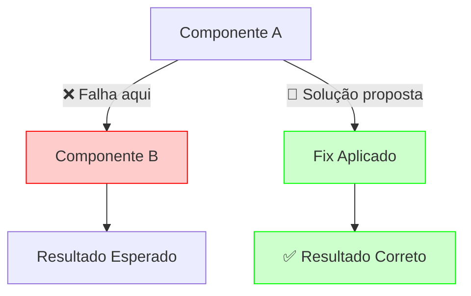

# 🔧 Solução: [Nome da Solução] - [Sistema/Componente Afetado]

**Tipo de Solução:** [Build | Runtime | Configuration | Integration | Performance]  
**Severidade:** [🔴 CRÍTICA | 🟡 ALTA | 🟢 MÉDIA | 🔵 BAIXA]  
**Complexidade:** [🚀 Simples | ⚡ Moderada | 🏗️ Complexa]  
**Escopo:** [Projeto Específico | Múltiplos Projetos | Sistema Completo]  
**Data:** [DD/MM/YYYY]  
**Status:** [✅ Validado | 🧪 Em Teste | 📋 Documentado | 🚀 Produção]  
**Responsável:** [Nome/Equipe]

---

## 🎯 **QUICK MATCH - AI DIAGNOSTIC**

### **❓ Use esta solução SE você tem:**
- [ ] **Erro específico**: `[Mensagem de erro exata ou padrão regex]`
- [ ] **Sintoma**: [Comportamento observado específico]
- [ ] **Contexto**: [Tecnologia/versão/ambiente específico]
- [ ] **Comando falhando**: `[comando específico que falha]`

### **❌ NÃO use esta solução SE:**
- [ ] **Contexto diferente**: [Situações onde não se aplica]
- [ ] **Versões incompatíveis**: [Limitações de versão]
- [ ] **Ambiente específico**: [Limitações de ambiente]

### **🏷️ Tags de Busca**
```yaml
Tecnologias: [tech1, tech2, tech3]
Sintomas: [sintoma1, sintoma2, sintoma3]
Comandos: [cmd1, cmd2, cmd3]
Erros: [error-pattern-1, error-pattern-2]
Arquitetura: [ESM, CommonJS, Workers, etc.]
```

---

## 🚨 **PROBLEMA IDENTIFICADO**

### **Contexto do Problema**
[Descrição detalhada do contexto onde o problema ocorre]

### **Sintomas Observados**
```bash
# Exemplo de erro/comportamento observado
[Mensagem de erro completa ou comportamento]
```

**Manifestações:**
- ✅ **Cenário que funciona**: [Descrição]
- ❌ **Cenário que falha**: [Descrição] 
- ⚠️ **Comportamento inconsistente**: [Descrição]

### **Impacto do Problema**
- **Bloqueio**: [O que fica bloqueado]
- **Workarounds**: [Soluções temporárias conhecidas]
- **Criticidade**: [Por que precisa ser resolvido]

### **Diagnóstico - Comandos de Verificação**
```bash
# Verificar se você tem este problema
[comando para diagnosticar]

# Verificar versões/contexto
[comando para verificar ambiente]

# Logs específicos para análise
[comando para ver logs relevantes]
```

---

## 🔍 **ANÁLISE DA CAUSA RAIZ**

### **Causa Principal**
[Explicação técnica da causa fundamental do problema]

### **Por que Acontece**
1. **[Fator 1]**: [Explicação detalhada]
2. **[Fator 2]**: [Explicação detalhada]
3. **[Fator 3]**: [Explicação detalhada]

### **Arquitetura/Fluxo Afetado**


### **Diferenças de Problemas Similares**
| **Este Problema** | **Problema Similar X** | **Diferença Chave** |
|-------------------|------------------------|---------------------|
| [Característica] | [Característica] | [Como distinguir] |

---

## ✅ **SOLUÇÃO IMPLEMENTADA**

### **Estratégia da Solução**
[Descrição de alto nível da abordagem escolhida e por quê]

### **Implementação Passo a Passo**

#### **Passo 1: [Nome do Passo]**
**Objetivo:** [O que este passo resolve]

```[linguagem]
# [Descrição do código/comando]
[código ou configuração específica]
```

**Validação:**
```bash
# Como verificar se este passo funcionou
[comando de verificação]
```

#### **Passo 2: [Nome do Passo]**
[Repetir estrutura similar para cada passo]

### **Configurações Finais**
```[formato]
# [Descrição da configuração final]
[configuração completa]
```

### **Por que Esta Solução Funciona**
1. **[Razão técnica 1]**: [Explicação]
2. **[Razão técnica 2]**: [Explicação]
3. **[Razão técnica 3]**: [Explicação]

---

## 📊 **VALIDAÇÃO E RESULTADOS**

### **Antes vs Depois**
| **Teste/Cenário** | **❌ Antes** | **✅ Depois** |
|-------------------|-------------|--------------|
| [Cenário 1] | [Comportamento antigo] | [Comportamento novo] |
| [Cenário 2] | [Comportamento antigo] | [Comportamento novo] |
| [Cenário 3] | [Comportamento antigo] | [Comportamento novo] |

### **Comandos de Validação Completa**
```bash
# Validação automática completa
[comando que testa tudo]

# Testes específicos
[comando 1]                    # [O que testa]
[comando 2]                    # [O que testa]
[comando 3]                    # [O que testa]

# Verificação de regressão
[comando para garantir que não quebrou nada]
```

### **Métricas de Sucesso**
```yaml
Performance:
  antes: [métrica anterior]
  depois: [métrica nova]
  melhoria: [X% ou Xms]

Estabilidade:
  taxa_sucesso_antes: [X%]
  taxa_sucesso_depois: [Y%]
  
Manutenibilidade:
  complexidade_antes: [Alta/Média/Baixa]
  complexidade_depois: [Alta/Média/Baixa]
```

---

## 🔄 **APLICAÇÃO A NOVOS CASOS**

### **Para Novos Projetos do Mesmo Tipo**
```bash
# Setup automático para novo projeto
[sequência de comandos ou script]
```

### **Para Projetos Similares**
1. **Identificar similaridades**: [Como saber se aplica]
2. **Adaptações necessárias**: [O que modificar]
3. **Validação**: [Como confirmar que funcionou]

### **Padrão Reutilizável**
```[linguagem]
// Template/função reutilizável baseada na solução
[código genérico que pode ser aplicado]
```

### **Automação Preventiva**
```bash
# Script para aplicar automaticamente
[script que detecta e aplica a solução]

# Integração no CI/CD
[como integrar para detectar o problema automaticamente]
```

---

## 🚨 **TROUBLESHOOTING**

### **Se a Solução NÃO Funcionar**

#### **Problema A: [Cenário específico]**
**Sintoma:**
```
[Mensagem de erro ou comportamento]
```

**Possível Causa:** [Explicação]

**Solução:**
```bash
[comandos para resolver este caso específico]
```

#### **Problema B: [Cenário específico]**
[Estrutura similar para outros casos]

### **Quick Fixes (Soluções Rápidas)**
```bash
# Reset/limpeza completa (último recurso)
[sequência de comandos para reset]

# Diagnóstico em uma linha
[comando que mostra status geral]

# Fix comum #1
[solução rápida para problema frequente]

# Fix comum #2  
[solução rápida para outro problema frequente]
```

### **Checklist de Diagnóstico**
- [ ] **[Verificação 1]**: `[comando]` deve retornar `[resultado esperado]`
- [ ] **[Verificação 2]**: `[comando]` deve retornar `[resultado esperado]`
- [ ] **[Verificação 3]**: `[comando]` deve retornar `[resultado esperado]`
- [ ] **[Verificação 4]**: `[comando]` deve retornar `[resultado esperado]`

### **Rollback (Se Necessário)**
```bash
# Como desfazer esta solução completamente
[sequência de comandos para reverter]
```

---

## 🎯 **CASOS DE USO E LIMITAÇÕES**

### **✅ Casos de Uso Validados**
1. **[Caso 1]**: [Descrição] - ✅ Funcionando
2. **[Caso 2]**: [Descrição] - ✅ Funcionando  
3. **[Caso 3]**: [Descrição] - ✅ Funcionando

### **❌ Limitações Conhecidas**
1. **[Limitação 1]**: [Descrição e contexto]
2. **[Limitação 2]**: [Descrição e contexto]

### **🔄 Compatibilidade**
```yaml
Tecnologias_Suportadas:
  - [tech1]: [versões]
  - [tech2]: [versões]
  
Ambientes_Testados:
  - [ambiente1]: ✅ Validado
  - [ambiente2]: ⚠️ Parcial
  - [ambiente3]: ❌ Não testado

Sistemas_Operacionais:
  - Linux: ✅ Validado
  - macOS: ✅ Validado  
  - Windows: ⚠️ Não testado
```

---

## 📚 **REFERÊNCIAS E CONTEXTO**

### **Problemas Relacionados**
- 📄 **[Solução relacionada 1]**: [link] - [relação]
- 📄 **[Solução relacionada 2]**: [link] - [relação]
- 📄 **[Problema upstream]**: [link] - [como se relaciona]

### **Issues/Discussões Externas**
- 🔗 **[Issue relevante]**: [URL] - [resumo]
- 🔗 **[Documentação oficial]**: [URL] - [seção específica]
- 🔗 **[StackOverflow]**: [URL] - [problema similar]

### **Tecnologias e Versões**
```yaml
Stack_Principal:
  - [Tecnologia]: [versão mínima] - [versão testada]
  - [Framework]: [versão mínima] - [versão testada]
  
Dependências_Críticas:
  - [lib1]: [versão] - [por que esta versão]
  - [lib2]: [versão] - [por que esta versão]
```

### **Histórico de Mudanças**
| **Versão** | **Data** | **Mudanças** | **Compatibilidade** |
|------------|----------|--------------|---------------------|
| [X.Y.Z] | [DD/MM/YYYY] | [Mudanças específicas] | [Impacto na compatibilidade] |

---

## 🎉 **STATUS FINAL E BENEFÍCIOS**

### **✅ Status de Produção**
- **Ambiente Desenvolvimento**: ✅ Validado
- **Ambiente Staging**: ✅ Validado  
- **Ambiente Produção**: ✅ Deploy Ready
- **Testes Automatizados**: ✅ Integrados

### **🚀 Benefícios Alcançados**
1. **[Benefício 1]**: [Métrica específica de melhoria]
2. **[Benefício 2]**: [Métrica específica de melhoria]
3. **[Benefício 3]**: [Métrica específica de melhoria]

### **💡 Lições Aprendidas**
- **✅ O que funcionou bem**: [Insights positivos]
- **⚠️ O que poderia ser melhor**: [Pontos de melhoria]
- **🔮 Próximas iterações**: [Evoluções planejadas]

### **🎯 Próximos Passos**
1. **[Ação 1]**: [Descrição e timeline]
2. **[Ação 2]**: [Descrição e timeline]
3. **[Ação 3]**: [Descrição e timeline]

---

## 📋 **QUICK REFERENCE PARA AI**

### **Comandos de Diagnóstico Rápido**
```bash
# Um comando que determina se esta solução se aplica
[comando único de diagnóstico]

# Status geral do sistema após aplicar solução
[comando de status]
```

### **Padrões de Erro que Esta Solução Resolve**
```regex
# Regex patterns para identificação automática
^[padrão de erro 1].*$
^[padrão de erro 2].*$
```

### **Tags de Classificação para Busca**
```yaml
problemas: [tag1, tag2, tag3]
tecnologias: [tech1, tech2, tech3]  
ambientes: [env1, env2, env3]
severidade: [crítica|alta|média|baixa]
complexidade: [simples|moderada|complexa]
```

---

**💡 Dicas de Uso deste Template:**

1. **🎯 Seja específico** nas mensagens de erro e sintomas
2. **🔍 Inclua comandos** de diagnóstico funcionais  
3. **📊 Documente resultados** antes/depois com métricas
4. **🔄 Teste a aplicação** em cenários similares
5. **🤖 Otimize para AI** com tags e padrões claros
6. **📚 Referencie problemas** relacionados quando relevante

---

**📅 Última Atualização do Template:** [DD/MM/YYYY]  
**📚 Versão do Template:** 1.0.0  
**🔗 Baseado em:** Análise de [build-solution.md, CORS_SOLUTION.md, worker-thread-solution.md] 