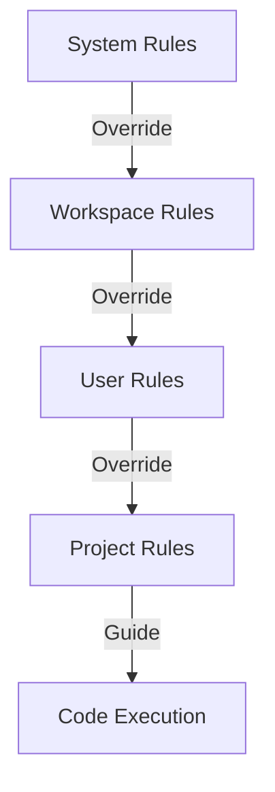

# ⚙️ Regras e Configurações do Workspace

## 📑 Índice

- [Regras de Workspace](#regras-de-workspace)
- [Regras do Sistema Onion](#regras-do-sistema-onion)
- [Regras do Usuário](#regras-do-usuário)
- [Regras do Nx](#regras-do-nx)
- [Memórias](#memórias)
- [Estrutura de Projeto](#estrutura-de-projeto)

---

## Regras de Workspace

### `language-and-documentation.mdc`

```typescript
rule: 'language-and-documentation';
location: '${CLAUDE_PLUGIN_ROOT}/reference/rules/language-and-documentation.mdc';
// Propósito: Define regras de idioma, documentação e fluxo de trabalho
// Escopo: Workspace-level, requestable by agent
```

**Conteúdo:**

- 🌍 Convenções de idioma (pt-BR/en-US)
- 📝 Padrões de documentação
- 🔄 Workflows de desenvolvimento
- 📋 Templates e formatos

---

## Regras do Sistema Onion

### Visão Geral

```typescript
system: 'Onion Framework';
version: '1.0';
// Propósito: Framework de comandos e agentes especializados
// Componentes: 46 comandos, 14+ agentes, ClickUp MCP integration
```

### 🎯 Contexto do Projeto

```markdown
Sistema Onion - Framework avançado de comandos e agentes
├── 26 comandos organizados por categoria
├── 14 agentes especializados de IA  
├── Integração completa com ClickUp MCP
└── Workflows automatizados de desenvolvimento
```

### 📝 Diretrizes de Linguagem

#### Código e Comentários

```typescript
rule: 'language-convention';
// Código, variáveis, funções: Inglês
// Comentários e documentação: Português brasileiro (pt-BR)
// Commits: Português brasileiro
// Logs e debugging: Inglês
```

**Exemplos:**

```typescript
// ✅ Correto
function calculateTotal(items: Item[]): number {
  // Calcula o total somando todos os itens
  return items.reduce((sum, item) => sum + item.price, 0);
}

// ❌ Incorreto
function calcularTotal(itens: Item[]): number {
  // Calculate total by summing all items
  return itens.reduce((soma, item) => soma + item.preco, 0);
}
```

### 🛠️ Padrões Técnicos

#### Estrutura de Arquivos

```typescript
structure: {
  commands: '${CLAUDE_PLUGIN_ROOT}/commands/',      // Organizados por categoria
  agents: '${CLAUDE_PLUGIN_ROOT}/agents/',          // YAML header + Markdown
  sessions: '.claude/sessions/<feature>/', // Contexto de desenvolvimento
  docs: 'docs/',                      // Documentação geral
  onion: 'docs/onion/',              // Docs do Sistema Onion
}
```

#### Padrões de Código

```typescript
standards: {
  conventions: 'Seguir convenções da linguagem/framework',
  readability: 'Priorizar legibilidade e manutenibilidade',
  typeHints: 'Usar type hints quando disponível',
  documentation: 'Documentar funções complexas',
}
```

### 🤖 Agentes Especializados

#### Uso de Agentes

```typescript
invocation: '@agente-nome';
// Propósito: Invocar agente específico para tarefa especializada
```

**Mapeamento de Agentes:**

```typescript
agents: {
  strategic: '@product-agent',           // Gestão de produto e ClickUp
  technical: '@clickup-specialist',      // Otimizações técnicas ClickUp MCP
  ide: '@cursor-specialist',             // Problemas IDE e configuração
  development: {
    python: '@python-developer',
    react: '@react-developer',
  },
  quality: '@code-reviewer',             // Review de código
  testing: '@test-engineer',             // Testes
  architecture: '@metaspec-gate-keeper', // Validação arquitetural
}
```

### ⚡ Performance e Produtividade

#### Otimizações

```typescript
optimization: {
  ignore: 'Minimizar arquivos irrelevantes com .cursorignore',
  context: 'Usar configurações otimizadas de context window',
  chunks: 'Preferir chunks menores para melhor performance',
  apiKeys: 'Configurar API keys apropriadas para models',
}
```

### 🎨 Formatação ClickUp MCP - Estratégia Dual

#### Task Descriptions

```typescript
format: 'markdown_description';
syntax: 'Markdown nativo';
// USE: ## Headers, | Tabelas |, **Bold**, - Listas
// QUANDO: create_task, update_task descriptions
// TEMPLATE: '${CLAUDE_PLUGIN_ROOT}/reference/docs/clickup/clickup-formatting.md' - seção DESCRIPTIONS
```

**Exemplo:**

```markdown
## Objetivo

Implementar autenticação JWT

## Requisitos

- Token expires em 24h
- Refresh token support
- Role-based access

| Endpoint | Method | Auth |
| -------- | ------ | ---- |
| /login   | POST   | No   |
| /refresh | POST   | Yes  |
```

#### Task Comments

```typescript
format: 'commentText';
syntax: 'Unicode visual';
// USE: ━━━, ∟, ▶, ◆, ✅
// QUANDO: create_task_comment, progress updates, PR comments
// TEMPLATE: '${CLAUDE_PLUGIN_ROOT}/reference/docs/clickup/clickup-formatting.md' - seção COMMENTS
// OBRIGATÓRIO: Timestamp + status em todos os comments
```

**Estrutura:**

```
━━━━━━━━━━━━━━━━━━━━━━━━━━━━━━━━━━━━━━━━━━
▶ [TÍTULO DO UPDATE] - 2025-01-27 14:30
━━━━━━━━━━━━━━━━━━━━━━━━━━━━━━━━━━━━━━━━━━

∟ Seção 1
  ◆ Item 1
  ◆ Item 2

✅ Próximos passos
━━━━━━━━━━━━━━━━━━━━━━━━━━━━━━━━━━━━━━━━━━
```

### 🔗 Integração ClickUp

#### Boas Práticas

```typescript
clickup: {
  sync: 'Sempre manter tasks sincronizadas',
  tags: 'Usar tags apropriadas para organização',
  progress: 'Atualizar progresso em tempo real',
  comments: 'Comentar mudanças importantes nas tasks',
}
```

### 📚 Documentação

#### Estrutura

```typescript
documentation: {
  location: 'docs/onion/',
  sync: 'Manter documentação sincronizada',
  examples: 'Usar exemplos práticos e casos de uso reais',
  structure: 'Estruturar informação para consumo por IA',
  troubleshooting: 'Incluir troubleshooting para problemas comuns',
}
```

### 🧪 Testes e Qualidade

#### Padrões

```typescript
quality: {
  tests: 'Incluir testes para funcionalidades críticas',
  validation: 'Validar mudanças arquiteturais com @metaspec-gate-keeper',
  linting: 'Usar linting e formatting automático',
  coverage: 'Manter cobertura de testes adequada',
}
```

### 🚀 Deployment

#### Fluxos

```typescript
deployment: {
  workflow: 'Seguir fluxos /engineer/* para desenvolvimento',
  branches: 'Usar feature branches para mudanças',
  commits: 'Manter commits atômicos e descritivos',
  breaking: 'Documentar breaking changes',
}
```

---

## Regras do Usuário

### Configuração Global

```typescript
userRules: {
  language: 'SEMPRE responder em pt-BR',
  code: 'SEMPRE códigos em en-US',
  comments: 'SEMPRE comentários em pt-BR',
  commits: 'SEMPRE commits em pt-BR',
  documentation: 'SEMPRE usar sintaxes oficiais das ferramentas',
}
```

### Prioridades

```markdown
IMPORTANTE:

- SEMPRE responda em pt-BR
- SEMPRE códigos em en-US e respostas e comentários e commits em pt-BR
- SEMPRE USE AS SINTAXES E ESTRATÉGIAS DAS VERSÕES OFICIAIS DA DOCUMENTAÇÃO
```

---

## Regras do Nx

### Workspace Configuration

```typescript
nx: {
  version: '19.5.3',
  packageManager: 'pnpm',
  mcpServer: 'Nx MCP server enabled',
}
```

### Guidelines Gerais

```typescript
guidelines: {
  understanding: 'Usar nx_workspace para entender arquitetura',
  config: 'Usar nx_docs para configurações e best practices',
  errors: 'Usar nx_workspace para erros de config/project graph',
  visualization: 'Usar nx_visualize_graph para demonstrar dependências',
}
```

### Guidelines de Geração

```typescript
generation: {
  step1: 'Aprender sobre workspace com nx_workspace e nx_project_details',
  step2: 'Obter generators com nx_generators',
  step3: 'Decidir qual generator usar ou instalar plugin',
  step4: 'Obter detalhes com nx_generator_schema',
  step5: 'Usar nx_docs para aprender mais',
  step6: 'Decidir opções minimalistas',
  step7: 'Abrir UI com nx_open_generate_ui',
  step8: 'Aguardar usuário finalizar',
  step9: 'Ler log com nx_read_generator_log',
  step10: 'Usar informações do log para continuar',
}
```

### Guidelines de CI Error

```typescript
ciError: {
  step1: 'Recuperar CIPEs com nx_cloud_cipe_details',
  step2: 'Se houver erros, usar nx_cloud_fix_cipe_failure',
  step3: 'Usar logs para identificar problema',
  step4: 'Ajudar usuário a fixar',
  step5: 'Garantir que problema foi resolvido rodando a task',
}
```

---

## Memórias

### Sistema de Memórias

```typescript
memory: {
  type: 'Agent-generated memories from past conversations',
  usage: 'Follow if deemed relevant',
  update: 'MUST update/delete when contradicted',
  citation: 'MUST cite using [[memory:MEMORY_ID]]',
  rejection: 'Mention if rejecting explicit request due to memory',
}
```

### Memórias Ativas

#### Memory #3004810

```typescript
memory: {
  id: 3004810,
  content: 'User prefers code, folder structures, and database schemas in English, and comments and examples in Portuguese (pt-br)',
  relevance: 'Code formatting and documentation',
}
// Citation: [[memory:3004810]]
```

---

## Estrutura de Projeto

### Diretórios Principais

```
${CLAUDE_PLUGIN_ROOT}/
├── commands/              # 46 comandos organizados
│   ├── product/           # 10 comandos
│   ├── engineer/          # 11 comandos
│   ├── git/               # 11 comandos
│   ├── docs/              # 9 comandos
│   ├── validate/          # 1 comando
│   ├── meta/              # 1 comando
│   └── common/            # Templates e prompts
├── agents/                # 14+ agentes especializados
├── reference/
│   ├── rules/             # Regras do workspace
│   ├── utils/             # Utilidades (clickup-formatting.md)
│   └── docs/
│       ├── onion/         # Documentação do Sistema Onion
│       └── tools/         # Esta documentação
└── ...

# Projeto do usuário:
seu-projeto/
├── .claude/
│   └── sessions/          # Contexto de desenvolvimento
└── ...
```

### Arquivos de Configuração

```
.cursorignore              # Otimização de contexto
.cursorrules               # Regras do Cursor (este arquivo)
nx.json                    # Configuração Nx
package.json               # Dependências (pnpm)
```

---

## 🎯 Hierarquia de Regras



### Ordem de Precedência

1. **System Rules** - Regras fundamentais do Cursor/Agent
2. **Workspace Rules** - Regras do workspace (.claude/rules/)
3. **User Rules** - Preferências do usuário
4. **Project Rules** - Regras específicas do projeto (Nx, etc)
5. **Memories** - Aprendizados de interações passadas

---

## 📋 Checklists de Conformidade

### ✅ Antes de Criar Código

- [ ] Verificar convenções de linguagem (EN code, PT-BR comments)
- [ ] Seguir estrutura de diretórios do projeto
- [ ] Usar type hints apropriados
- [ ] Documentar funções complexas

### ✅ Antes de Commit

- [ ] Mensagem em pt-BR
- [ ] Código em inglês
- [ ] Linter passou
- [ ] Testes passando

### ✅ Antes de Criar Task ClickUp

- [ ] Usar markdown nativo em description
- [ ] Tags apropriadas
- [ ] Assignees corretos
- [ ] Due date definido

### ✅ Antes de Comentar Task ClickUp

- [ ] Usar formatação Unicode
- [ ] Incluir timestamp
- [ ] Incluir status
- [ ] Seguir template de comments

---

## 🔗 Recursos Relacionados

- [Ferramentas MCP](./mcps.md)
- [Agentes Especializados](./agents.md)
- [Comandos](./commands.md)
- [Workflows](./workflows.md)
