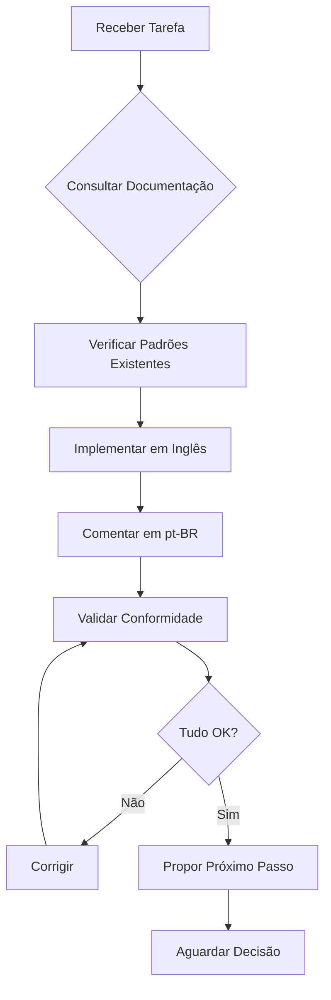

# Language and Documentation Standards

## 🎯 Objetivo

Estabelecer padrões consistentes de idioma e documentação em todo o projeto, garantindo que código seja universal (inglês) enquanto comunicação e explicações sejam localizadas (pt-BR).

## 📋 Regras Fundamentais

### 1. Idiomas no Código

#### ✅ SEMPRE em Inglês (en-US)
- **Nomes de variáveis, funções, classes e interfaces**
  ```typescript
  // ✅ CORRETO
  interface UserProfile {
    userName: string;
    createdAt: Date;
  }
  
  // ❌ INCORRETO
  interface PerfilUsuario {
    nomeUsuario: string;
    criadoEm: Date;
  }
  ```

- **Nomes de arquivos e diretórios**
  ```
  ✅ user-profile.component.tsx
  ✅ authentication-service.ts
  ❌ perfil-usuario.component.tsx
  ❌ servico-autenticacao.ts
  ```

- **Commits no Git**
  ```bash
  # ✅ CORRETO
  git commit -m "feat: add user authentication flow"
  
  # ❌ INCORRETO
  git commit -m "feat: adicionar fluxo de autenticação"
  ```

- **Nomes de branches**
  ```bash
  ✅ feature/user-dashboard
  ✅ fix/authentication-bug
  ❌ feature/painel-usuario
  ❌ fix/erro-autenticacao
  ```

- **Documentação técnica de API (schemas, endpoints, responses)**

#### ✅ SEMPRE em English (en-GB)
- **Comentários no código**
  ```typescript
  // ✅ CORRETO
  /**
   * Busca o perfil do usuário no banco de dados
   * @param userId - ID único do usuário
   * @returns Perfil completo ou null se não encontrado
   */
  async function getUserProfile(userId: string): Promise<UserProfile | null> {
    // Valida se o ID é válido antes de fazer a consulta
    if (!isValidUUID(userId)) {
      return null;
    }
    // ... resto da implementação
  }
  
  // ❌ INCORRETO
  /**
   * Fetch user profile from database
   * @param userId - Unique user ID
   * @returns Full profile or null if not found
   */
  ```

- **Respostas e explicações do assistente IA**
- **Documentação de processos e workflows**
- **READMEs e guias de uso** (exceto código e comandos)
- **Mensagens de erro personalizadas para usuários finais**
- **Logs de aplicação voltados para debugging**

### 2. Documentação do Projeto

#### ✅ Manter Sincronizado com a Documentação
- **Antes de implementar qualquer mudança estrutural:**
  1. Consultar documentação existente em `/docs/`
  2. Verificar padrões estabelecidos em `${CLAUDE_PLUGIN_ROOT}/commands/`
  3. Revisar agentes especializados em `${CLAUDE_PLUGIN_ROOT}/agents/`
  4. Ler regras de projeto em `.claude/rules/`

- **Ao introduzir novos padrões:**
  1. Documentar em `${CLAUDE_PLUGIN_ROOT}/reference/docs/` ou `/docs/` conforme apropriado
  2. Atualizar comandos relacionados em `${CLAUDE_PLUGIN_ROOT}/commands/`
  3. Notificar sobre mudanças em padrões estabelecidos

#### ✅ Hierarquia de Documentação
```
/docs/                          # Documentação de negócio e produto
├── meta-specs/                 # Especificações meta do projeto
├── technical-context/          # Contexto técnico e arquitetura
└── business-context/           # Contexto de negócio

${CLAUDE_PLUGIN_ROOT}/           # Framework de desenvolvimento
├── reference/docs/              # Documentação de processo e workflow
│   ├── templates/               # Templates reutilizáveis
│   └── guides/                  # Guias específicos
├── commands/                    # Comandos
│   ├── meta/                    # Comandos meta (criar comandos, etc)
│   ├── development/             # Comandos de desenvolvimento
│   └── docs/                    # Comandos de documentação
├── agents/                      # Agentes especializados
│   ├── meta/                    # Agentes meta (Onion, etc)
│   └── development/             # Agentes de desenvolvimento
└── reference/rules/             # Regras do framework
```

### 3. Sintaxes e Estratégias Oficiais

#### ✅ SEMPRE Consultar Documentação Oficial
- **ZenStack**: Usar sempre a sintaxe da versão oficial no projeto
- **NX**: Seguir padrões de workspace da versão instalada
- **Tamagui**: Aderir às convenções de componentes universais
- **Expo**: Respeitar limitações e features do SDK atual
- **React Native**: Seguir patterns recomendados pela versão em uso

#### ⚠️ NUNCA Inventar Sintaxe
- Verificar documentação oficial antes de implementar
- Testar em sandbox se houver dúvida
- Documentar desvios necessários com justificativa

### 4. Workflow de Execução

#### ✅ SEMPRE Antes de Finalizar
1. **Propor próximo passo lógico:**
   ```markdown
   ## 🚀 Próximo Passo Sugerido
   
   Agora que criamos [X], o próximo passo recomendado é:
   
   **Opção 1 (Recomendada):** [Ação + Justificativa]
   **Opção 2:** [Ação Alternativa + Justificativa]
   
   Deseja prosseguir com alguma dessas opções ou tem outra prioridade?
   ```

2. **Validar conformidade:**
   - ✅ Código em inglês?
   - ✅ Comentários em pt-BR?
   - ✅ Documentação atualizada?
   - ✅ Padrões do projeto respeitados?

3. **Oferecer comando para continuar:**
   ```markdown
   **Comando sugerido:**
   `/development/test-integration --component=UserProfile`
   
   ou
   
   `@onion "implementar testes unitários para UserProfile"`
   ```

## 🔄 Fluxo de Trabalho Completo



## 📚 Exemplos Práticos

### Exemplo 1: Criação de Componente

```typescript
// ✅ CORRETO: Código em inglês, comentários em pt-BR

/**
 * Componente de perfil de usuário com informações básicas
 * 
 * @component
 * @example
 * ```tsx
 * <UserProfileCard userId="123" showActions={true} />
 * ```
 */
export const UserProfileCard: React.FC<UserProfileCardProps> = ({
  userId,
  showActions = false
}) => {
  // Busca os dados do usuário usando o hook do ZenStack
  const { data: user, isLoading } = useFindUniqueUser({
    where: { id: userId }
  });

  // Exibe skeleton enquanto carrega
  if (isLoading) {
    return <ProfileSkeleton />;
  }

  // Se não encontrou, exibe mensagem
  if (!user) {
    return <EmptyState message="Usuário não encontrado" />;
  }

  return (
    <Card>
      <CardHeader>
        <Avatar src={user.avatarUrl} alt={user.name} />
        <Title>{user.name}</Title>
      </CardHeader>
      {showActions && (
        <CardActions>
          {/* Botões de ação do perfil */}
          <Button variant="primary">Editar</Button>
          <Button variant="secondary">Mensagem</Button>
        </CardActions>
      )}
    </Card>
  );
};
```

### Exemplo 2: Documentação de Feature

```markdown
# User Authentication Flow

## Descrição

Sistema de autenticação multi-fator implementado com ZenStack e NextAuth.

## Componentes Principais

### `AuthProvider`
Provedor de contexto que gerencia o estado de autenticação em toda a aplicação.

**Uso:**
\`\`\`tsx
import { AuthProvider } from '@company/auth';

function App() {
  return (
    <AuthProvider>
      <YourApp />
    </AuthProvider>
  );
}
\`\`\`

## Fluxo de Autenticação

1. Usuário acessa página de login
2. Insere credenciais (email + senha)
3. Sistema valida no banco de dados
4. Se MFA habilitado, solicita código
5. Gera token JWT e armazena no cookie seguro
6. Redireciona para dashboard

## Próximos Passos

- [ ] Implementar autenticação biométrica
- [ ] Adicionar login social (Google, Facebook)
- [ ] Melhorar UX do fluxo de MFA
```

## ⚡ Quick Reference

| Contexto | Idioma | Exemplo |
|----------|--------|---------|
| Código (vars, funcs, classes) | 🇺🇸 Inglês | `getUserProfile()` |
| Comentários no código | 🇺🇸 Inglês | `// Busca perfil do usuário` |
| Commits | 🇺🇸 Inglês | `fix: resolve auth bug` |
| Documentação técnica | 🇺🇸 Inglês | `## Instalação` |
| Respostas do assistente | 🇺🇸 Inglês | `Vou criar o componente...` |
| Nomes de arquivos | 🇺🇸 Inglês | `user-profile.tsx` |
| Logs de debug | 🇺🇸 Inglês | `console.log('Usuário autenticado')` |
| Mensagens de erro | 🇺🇸 Inglês | `throw new Error('Usuário não encontrado')` |

## 🎯 Checklist de Conformidade

Antes de finalizar qualquer tarefa, verificar:

- [ ] Todo código (variáveis, funções, classes) está em inglês
- [ ] Todos os comentários estão em português (pt-BR)
- [ ] Commits seguem padrão conventional em inglês
- [ ] Documentação foi atualizada quando necessário
- [ ] Sintaxe oficial das bibliotecas foi respeitada
- [ ] Próximo passo foi proposto ao usuário
- [ ] Comando de continuação foi sugerido

## 🚨 Exceções

### Quando usar inglês em comentários:
- Referências diretas a código: "O método `getUserById()` retorna..."
- Links para documentação oficial em inglês
- Termos técnicos sem tradução estabelecida

### Quando usar português no código:
- **NUNCA** (exceto em strings de UI para usuário final)
- Mensagens de erro para usuário final
- Labels de formulário
- Textos de interface

## 📖 Referências

- [Conventional Commits](https://www.conventionalcommits.org/)
- [JSDoc em Português](https://jsdoc.app/)
- [NX Workspace Patterns](https://nx.dev/concepts)
- [ZenStack Documentation](https://zenstack.dev/)

---

## 🔐 Gestão de Configurações

### Variáveis de Ambiente (.env)
- **NUNCA** commitar `.env` com valores sensíveis
- **SEMPRE** manter `.env.example` atualizado com placeholders
- Usar prefixos para organização: `CLICKUP_`, `GITHUB_`, `DB_`

```bash
# ✅ CORRETO - .env.example
CLICKUP_API_TOKEN=your_token_here
GITHUB_TOKEN=ghp_xxxxxxxxxxxx

# ❌ INCORRETO - Nunca no repositório
CLICKUP_API_TOKEN=pk_12345_secret
```

### Integrações Opcionais
- Comandos e agentes devem funcionar sem integrações quando possível
- Se integração não configurada: perguntar ao usuário ou abortar com mensagem clara
- Documentar variáveis necessárias no header do comando/agente

## 📚 Knowledge Bases

As Knowledge Bases do projeto estão em `docs/knowbase/`:

| KB | Propósito |
|----|-----------|
| `cursor-commands-best-practices-2025.md` | Padrões de comandos Cursor |
| `spec-as-code-strategy.md` | Estratégia de especificações |
| `ai-agent-design-patterns.md` | Padrões de design de agentes |
| `context-window-optimization.md` | Otimização de contexto |
| `configuration-management.md` | Gestão de configurações |

---

**Última atualização:** 2025-11-24  
**Versão:** 3.0.0  
**Mantido por:** Sistema Onion
